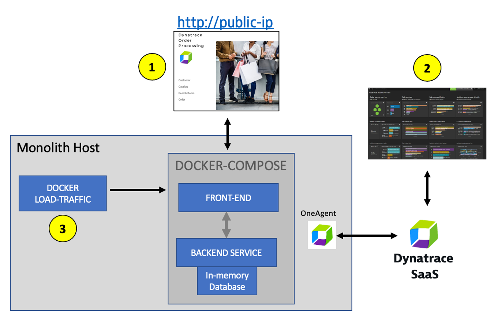
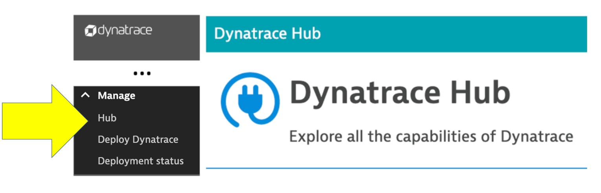
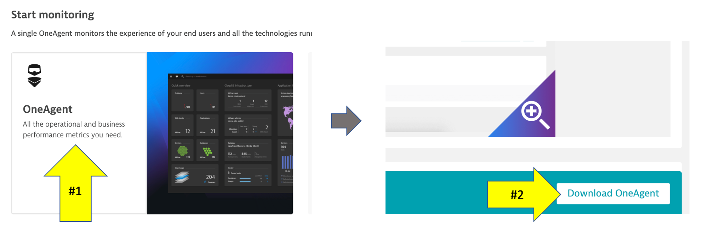
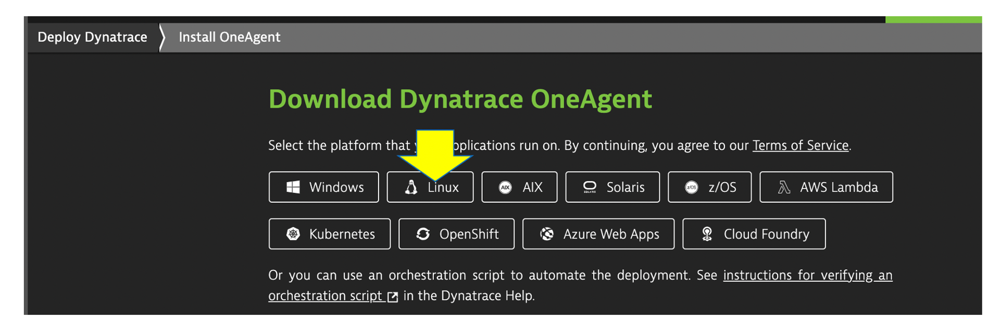
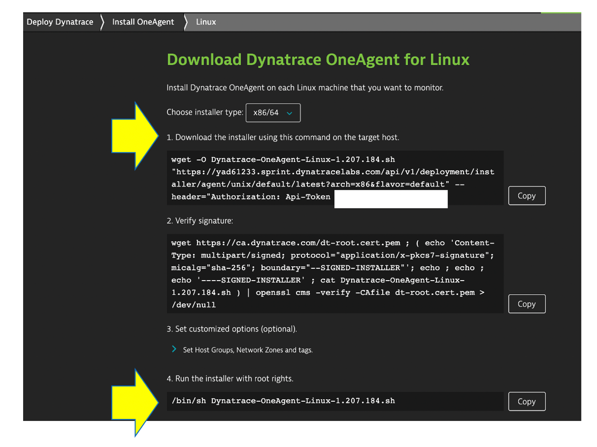
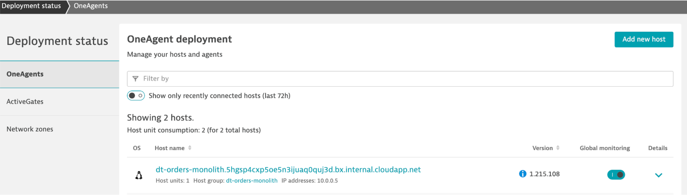

id: lab-1
categories: azure
status: Published
tags: cloud
# LAB 1 - OneAgent Observability

## Overview

While choosing the right migration strategies, such as re-hosting or re-architecting, one must assess the different risks, costs, and benefits. However, often the details of what is where and what is dependent on what within the technical stack is missing or poorly documented.  All that may exist is out of date diagrams and a mix of monitoring tool metrics that must be "stiched" together.

Not having enough details about the current environment is hindering organizations ability to make the right decisions when planning what to migrate and when.

To address this problem, Dynatrace’s OneAgent can automatically discover the application, services, processes and to build a complete dependency mapping for the entire application environment. So, let’s begin!

### Objectives of this Lab

🔷 Review Dynatrace OneAgent

🔷 Review real-time data now available for the sample application

🔷 Review how Dynatrace helps with modernization planning

🏫**Class Note** - Please update the Tracking Spreadsheet if you've completed the task on this step.

### Lab Setup

Referring to the picture below, here are the components for lab 1.

**#1 . Sample Application**

Sample app representing a simple architecture of a frontend and backend implemented as Docker containers that we will review in this lab.

**#2 . Dynatrace monitoring**

The Dynatrace OneAgent has been installed by the workshop provisioning scripts and is communicating to your Dynatrace tenant.

**#3 . Load generator process**

A docker processes that sends simulated user traffic to the sample app using <a href="https://github.com/dt-orders/load-traffic" target="_blank"> Jmeter </a> run within a Docker container.  You will not need to interact with this container; it just runs in the background.



### 💥 **TECHNICAL NOTE**: 
_A real-world scenario would often start with the application components running on a physical or virtualized host in on-prem and not "Dockerized". To simplify the workshop, we "Dockerized" the application into a front-end and back-end. In Dynatrace, these Docker containers all show up as "processes" on a host just like a "non-Dockerized" application will._

## OneAgent

The host running the sample application was created using scripts to install and run the Sample Application and to install the Dynatrace OneAgent. All these scripts you can review <a href="https://github.com/dt-alliances-workshops/azure-modernization-dt-orders-setup.git" target="_blank"> here </a> within the `provision-scripts` subfolder.

The Dynatrace OneAgent was also preinstalled and is sending data to your Dynatrace environment using the <a href="https://www.dynatrace.com/support/help/technology-support/cloud-platforms/microsoft-azure-services/oneagent-integration/integrate-oneagent-on-azure-virtual-machines/" target="_blank">Dynatrace OneAgent VM Extension for Azure </a>

The Azure CLI command for setting up the OneAgent VM extension looks like:

```
az vm extension set \
    --publisher dynatrace.ruxit \
    --name "$AGENT" \
    --resource-group "$AZURE_RESOURCE_GROUP" \
    --subscription "$AZURE_SUBSCRIPTION" \
    --vm-name "$HOSTNAME" \
    --settings "{\"tenantId\":\"$DT_ENVIRONMENT_ID\",\"token\":\"$DT_PAAS_TOKEN\", \"server\":\"$DT_BASEURL/api\", \"hostGroup\":\"$HOSTGROUP_NAME\"}" 
```

### Another way to install the OneAgent 

1. Choose the `Hub` option from the left side menu to open the OneAgent deployment page. 



1. Explore all the capabilities of Dynatrace while you are in the Hub

1. Pick the `OneAgent` under the `Start monitoring` section, then click the `Download Agent` at the bottom of the page to open the `Download agent` page.



1. On the `Download agent` page, pick the platform `Linux` to view the commands will download and run the OneAgent installer.



### 💥 **TECHNICAL NOTE** 

_The URL and Token is unique to your Dynatrace tenant.  If you expand the `Set customized options (optional).` section you can review other options for the OneAgent installer._

### 💥 **TECHNICAL NOTE** 

_Setting the hostname via  `/bin/sh Dynatrace-OneAgent-Linux-1.207.184.sh --set-host-name=monolith` is just <a href="https://www.dynatrace.com/support/help/how-to-use-dynatrace/hosts/configuration/set-custom-host-names-in-dynamic-environments/" target="_blank"> one of the ways </a> to customize host naming._

1. These are the commands used to download, verify, and install the OneAgent.  **That is it!**



1. Go back the `Download agent` page and review other options like Windows or Kubernetes.

### 💥 **TECHNICAL NOTE** 

_To learn more about the various ways the OneAgent can be installed, check out the <a href="https://www.dynatrace.com/support/help/setup-and-configuration/dynatrace-oneagent/" target="_blank"> Dynatrace Documentation</a>_

### Tasks to complete this step

<details>
<summary>Task - Review OneAgent Status for Monolith VM</summary>

### 💥 **TECHNICAL NOTE** 

OneAgent has already been installed on the host running the sample application.  Let's review the status of the OneAgent to ensure its reporting in to your Dynatrace enviornment.

1. Login into Dynatrace UI

2. Choose the `Manage --> Deployment Status` option from the left side menu to open the OneAgent deployment page.

3. Check to enssure the `dt-orders-monolith` VM is reporting in under OneAgents



</details>

## Task 3

 Duration: 3

We hope you enjoyed this lab and found it useful. We would love your feedback!
<form>
  <name>How was your overall experience with this lab?</name>
  <input value="Excellent" />
  <input value="Good" />
  <input value="Average" />
  <input value="Fair" />
  <input value="Poor" />
</form>

<form>
  <name>What did you benefit most from this lab?</name>
  <input value="Deploy OneAgent to a Kubernetes" />
  <input value="GitOps / Monitoring as code approach" />
  <input value="Service Level Objectives" />
  <input value="Releases" />
</form>

<form>
  <name>How likely are you to recommend this lab to a friend or colleague?</name>
  <input value="Very Likely" />
  <input value="Moderately Likely" />
  <input value="Neither Likely nor unlikely" />
  <input value="Moderately Unlikely" />
  <input value="Very Unlikely" />
</form>

Positive
: 💡 For other ideas and suggestions, please **[reach out via email](mailto:jay.gurbani@dynatrace.com?subject=Kubernetes Workshop - Ideas and Suggestions")**.
