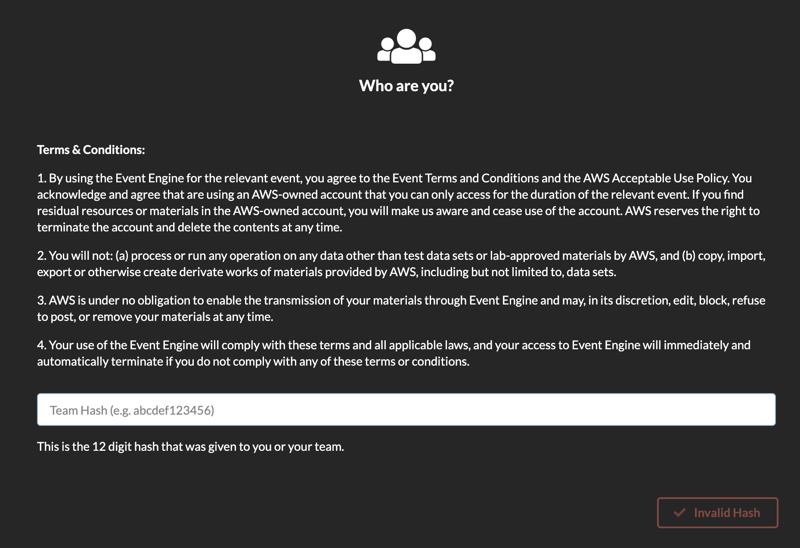
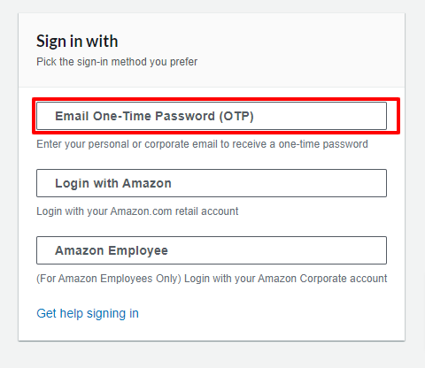
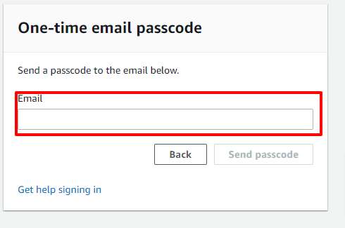
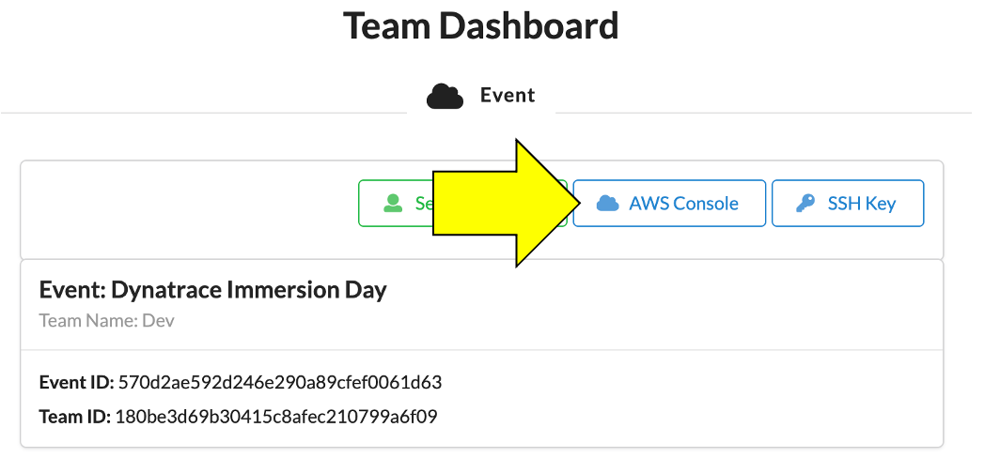
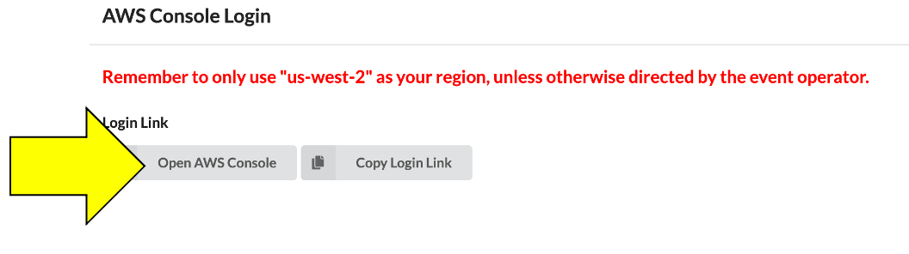
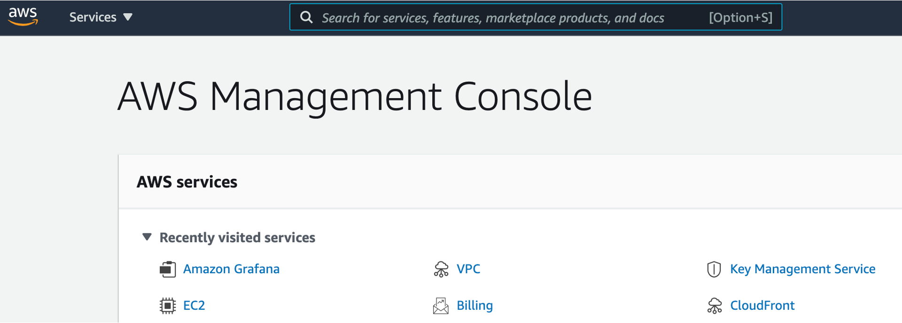
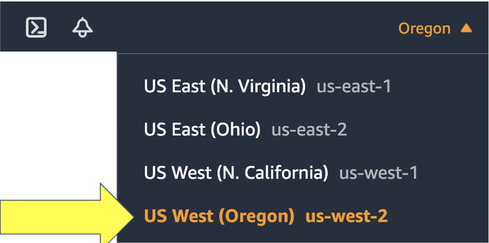
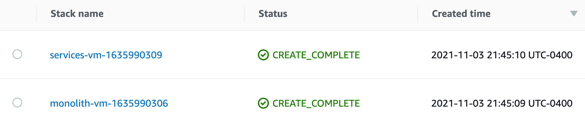

# AWS Lab 0 - Introduction and Setup SAAS

## AWS Immersion Day Objectives

This virtual hands-on workshop will start with a review of common challenges associated with modernization followed by a review of how Dynatrace’s AI-engine, Davis, performs automatic and intelligent root-cause analysis in hybrid cloud AWS environments. This will be followed by series of hands-on labs where you will:

1. Setup a sample applications within AWS
1. Jump in and fully analyze an application within your Dynatrace tenant
1. Start to see and understand application usage patterns, infrastructure consumption, service dependencies, benchmarking performance and how service levels can be tightly ensured.

You are now in the drivers seat for enabling modern operations for cloud native architectures!

### Workshop structure

The workshop breaks down into three sections.  Plan on 4 plus hours for completion of the lab section.

* **Prerequisites** - Ensure your Dynatrace and AWS accounts are set-up
* **Workshop Labs** - Divided into modules, some labs include a step to run scripts that will provision AWS resources, deploy sample application, and configure Dynatrace.

### Workshop Audience

* Application teams
* Architects
* Developers
* Technical leads

It will be helpful for you to be:

* Able to run basic [Unix commands](http://mally.stanford.edu/~sr/computing/basic-unix.html){target="_blank"}
* Familiar with basic [AWS cloud concepts](http://aws.amazon.com/getting-started/fundamentals-core-concepts/){target="_blank"}
* Familiar with [container concepts](https://aws.amazon.com/containers/){target="_blank"}

## Dynatrace Tenant Pre Requisite

You should have completed the following during the pre requisite lab 0:

* Deployed your Dynatrace SAAS tenant
* Saved your Dynatrace SAAS tenant url
* Created the All In One Token 
* Created the Provisioning Script that will deploy the AWS assets during this workshop

If you are unable to login, please let the instructor know.

## AWS Account

To complete this workshop, you will be provided with an AWS account via the AWS Event Engine service. A team hash will be provided to you by event staff.

1 . If you are currently logged in to an AWS Account, you can log out using this [link](https://console.aws.amazon.com/console/logout!doLogout){target="_blank"}

2 . Connect to the portal by clicking the button or browsing to [https://dashboard.eventengine.run](https://dashboard.eventengine.run){target="_blank"}. The following screen shows up. Enter the provided hash in the text box. The button in the bottom right corner changes to **Accept Terms & Login**. Click on that button to continue.



3 . Click on `Email One-Time Password (OTP)`



4 . Add email address to `Send passcode`.



5 . Once on the `Team dashboard` page, click the `AWS console` button that opens a popup.  



6 . On the popup, click on `Open AWS console` button which opens the AWS portal.



7 . One the new browser tab, you should see the AWS portal. 



8 . Once you are in the AWS portal, you can now move to the next section.

### 💥 **TECHNICAL NOTE**

*Once the free credits for this account expire, all the resources created will be automatically de-provisioned and you will not be able to access the account.*


## AWS Prep

<!--
### 1. Make sure you are in the correct region 

Click the region button in the top right corner of your AWS console and make sure you are in `Oregon us-west-2` for consistency in this lab.


-->

### 1. Open up Cloudshell

In this lab, we will be using AWS Cloudshell. Cloudshell is a browser-based shell that makes it easy to securely manage, explore, and interact with your AWS resources.

To open the Cloudshell, click on the Cloudshell icon at the top of the AWS console.  This make take a minute to complete.


This may open up a slash page. 


After closing the pop-up, wait a minute for the Cloudshell to initialize.  When this is done, you will see the command prompt as shown below.


### 2. Clone the workshop scripts

Once you have the Cloudshell open, you need to get some scripts that will automate the workshop setup.  Run this command:

```
git clone https://github.com/dt-alliances-workshops/aws-modernization-dt-orders-setup.git
```

It should look like this:

```
[cloudshell-user@ip-10-0-52-50 ~]$ git clone https://github.com/dt-alliances-workshops/aws-modernization-dt-orders-setup.git

Cloning into 'aws-modernization-dt-orders-setup'...

remote: Enumerating objects: 161, done.
remote: Counting objects: 100% (161/161), done.
remote: Compressing objects: 100% (96/96), done.
remote: Total 161 (delta 72), reused 143 (delta 60), pack-reused 0
Receiving objects: 100% (161/161), 19.82 MiB | 22.21 MiB/s, done.
Resolving deltas: 100% (72/72), done.
```

## Provision VM

This step creates two CloudFormation stacks that do the following:

* Add two EC2 instance named: `dt-orders-monolith` and `dt-orders-services`
* At EC2 startup, it installs `Docker` and `Docker-Compose`
* At EC2 startup, it installs the `OneAgent` for your Dynatrace tenant
* Starts up the sample application by running `docker-compose up`

### 1. Copy provisioning script command

Created during the pre requisite lab copy and paste the command you created and saved in your notepad.  It should look like:

```
cd ~/aws-modernization-dt-orders-setup/provision-scripts && ./provision-workshop.sh {tenant URL} {Dynatrace token} {Tenant Email}
```

### 2. Run the provisioning script command

Within the AWS SSH shell, paste the full command and you should see a prompt to proceed as shown below.

```
===================================================================
About to Provision Workshop for:
https://syh360.dynatrace-managed.com/e/aaaaa-bbbb-ccccc-ddddd
SETUP_TYPE   = all
KEYPAIR_NAME = ee-default-keypair
===================================================================
Proceed? (y/n) : 
```

Once the script complete, you should see output as shown below.

```
-----------------------------------------------------------------------------------
Done Setting up Workshop config
End: Thu Nov  4 01:45:06 UTC 2021
-----------------------------------------------------------------------------------
Create AWS resource: monolith-vm
{
    "StackId": "arn:aws:cloudformation:us-west-2:838488672964:stack/monolith-vm-1635990306/d82cd2b0-3d10-11ec-a495-023df82ab493"
}
Create AWS resource: services-vm
{
    "StackId": "arn:aws:cloudformation:us-west-2:838488672964:stack/services-vm-1635990309/d8a6e4b0-3d10-11ec-a495-023df82ab493"
}
```

### 3. Verify CLoudFormation Stacks

The CloudFormation may take a few minutes, but you can check the CloudFormation output to ensure that all the AWS resources were provisioned successfully. 

Monitor CloudFormation stack status within the AWS console. Navigate to the `CloudFormation` page or just navigate to:
* [https://console.aws.amazon.com/cloudformation/home](https://console.aws.amazon.com/cloudformation/home){target="_blank"}

When it is complete, it will show a `CREATE_COMPLETE` status as shown below.s


 
### 💥 **TECHNICAL NOTE**

_The process to provision everything will take ~5 minutes, so please be patient._

## Dynatrace Configuration

You will also notice output from the provision script that was add the following Dynatrace configuration: 

* Set global [Frequent Issue Detection](https://www.dynatrace.com/support/help/how-to-use-dynatrace/problem-detection-and-analysis/problem-detection/detection-of-frequent-issues/){target="_blank"} settings to Off
* Adjust the [Service Anomaly Detection](https://www.dynatrace.com/support/help/shortlink/problem-detection-sensitivity-services){target="_blank"}
* Add [Management Zones](https://www.dynatrace.com/support/help/how-to-use-dynatrace/management-zones/){target="_blank"} for the monolith version of the application
* Add [Auto Tagging Rules](https://www.dynatrace.com/support/help/how-to-use-dynatrace/tags-and-metadata/){target="_blank"} to drive management zone and SLO settings
* Add [SLOs](https://www.dynatrace.com/support/help/how-to-use-dynatrace/service-level-objectives/){target="_blank"} for a use in custom dashboards

The scripts use a combination of [Dynatrace Monitoring as Code](https://github.com/dynatrace-oss/dynatrace-monitoring-as-code) framework (a.k.a. monaco) and configuration using the [Dynatrace Configuration API](https://www.dynatrace.com/support/help/dynatrace-api/configuration-api/) for those few Dynatrace configurations not yet supported by monaco.  

You can review the Monitoring as Code workshop files [in the GitHub repo](https://github.com/dt-alliances-workshops/aws-modernization-dt-orders-setup/tree/main/workshop-config)

## Summary

In this section, you should have completed the following:

✅ Ensure your Dynatrace account is ready

✅ Ensure your AWS Account is ready

✅ Provision the workshop resources

You are now ready to proceed with the labs.
