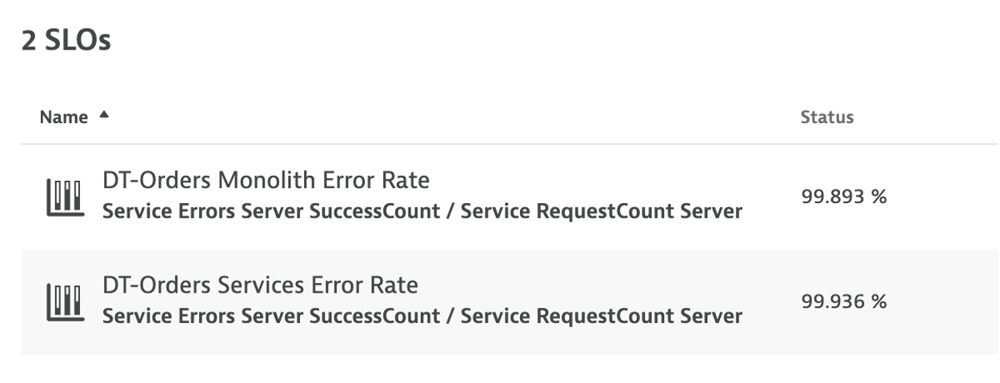

# AWS Lab 3 - SLOs

## Overview

In order to do more with less and scale, organizations must transcend IT silos, foster collaboration and improve productivity. Automation and a common data model are key components of this, but it takes platforms that support operational teams and workflows. 

### Objectives of this Lab

🔷 Examine Dynatrace Service Level Objectives (SLOs)

🔷 Create a custom dashboard with SLOs 

## SLOs

Dynatrace provides all the necessary real-time information that your Site-Reliability Engineering (SRE) teams need to monitor their defined objectives.

An SRE team is responsible for finding good service-level indicators (SLIs) for a given service in order to closely monitor the reliable delivery of that service. SLIs can differ from one service to the other, as not all services are equally critical in terms of time and error constraints.

Dynatrace offers more than 2000 different metrics that are ready for use as dedicated SLIs.

Each SLO definition can be evaluated by following two result metrics:

* **SLO status:** The current evaluation result of the SLO, expressed as a percentage. The semantics of this percentage (for example, 99.3% of all service requests are successful, or 99.99% of all website users are “satisfied” in terms of Apdex rating) and the target defined for this percentage are up to the SRE team.

* **SLO error budget:** The remaining buffer until the defined SLO target is considered as failed. For example, if an SLO defines a 95% target and its current SLO status is evaluated as 98%, the remaining error budget is the difference between the SLO status and the SLO target.
Two SLOs were created for you, so review those.

Here is an example custom dashboard with SLO dashboard tiles.

img/lab2-slo-dashboard.png)

### Review your environment

From the left menu in Dynatrace, click the `SLO` option to review the two SLOs that are already setup.  Edit one of them to review the configuration.

 

### 👍 How this helps

You can review the current health status, error budgets, target and warning, along with the timeframe of all your SLOs on the SLOs overview page.

Davis provides quick notifications on anomalies detected, along with actionable root causes. If your SLO has turned red, this is most likely because Davis has already raised a problem for the underlying metrics, showing you the root cause.

### 💥 **TECHNICAL NOTE** 

<i>See the [Dynatrace Docs](https://www.dynatrace.com/support/help/how-to-use-dynatrace/service-level-objectives/){target="_blank"} for more details on SLOs</i>

## View SLO Dashboard

From the left side menu in Dynatrace, pick the `dashboard` menu.

Click the `Cloud Migration Success` to open the dashboard

You should now see the dashboard

### Edit Dashboard

Now you need to edit the dashboard and adjust the tiles with the SLOs and databases in your environment.

On the top right of the page, click the `edit` button and then follow these steps:

### Edit Dynamic requests tile

1. Click on the title of the Dynamic requests tile to open the Service properties window on the right side 
1. On the Service properties window, pick the monolith `frontend (monolith-frontend)` service
1. Click the `Done` button

### Edit remaining tiles

1. Repeat the same steps above for the Cloud services tile, but pick the `frontend (dev-frontend)` in the Service properties window
1. Repeat for the two SLO tiles, but pick the associated SLO from the drop down list in the SLO properties window
1. Repeat for the two database tiles. For Cloud services application there are 3 databases, so just pick one of the database of a demo.
1. Click the `Done` button to save the dashboard

## Summary

In this section, you should have completed the following:

✅ Examine Dynatrace Service Level Objectives (SLOs)

✅ Create a custom dashboard with SLOs
