# AWS Lab 4 - AWS CloudWatch Integration

## Overview

For intelligent monitoring of services running in Amazon cloud, you can integrate Dynatrace with Amazon Web Services (AWS). AWS integration helps you stay on top of the dynamics of your data center in the cloud.

### Objectives of this Lab

🔷 Review how Dynatrace integrates with [AWS CloudWatch](https://aws.amazon.com/cloudwatch/){target="_blank"}

🔷 Review how [Metric events for alerts](https://www.dynatrace.com/support/help/how-to-use-dynatrace/problem-detection-and-analysis/problem-detection/metric-events-for-alerting/){target="_blank"}

## AWS Dashboard

In addition to monitoring your AWS workloads using OneAgent, Dynatrace provides integration with AWS CloudWatch which adds infrastructure monitoring to gain insight even into serverless application scenarios.

### 👍 How this helps

Dynatrace brings value by enriching the data from AWS CloudWatch extending observability into the platform with additional metrics for cloud infrastructure, load balancers, API Management Services, and more.

These metrics are managed by Dynatrace's AI engine automatically and this extended observability improves operations, reduces MTTR and increases innovation. 

Here is an example from another environment.

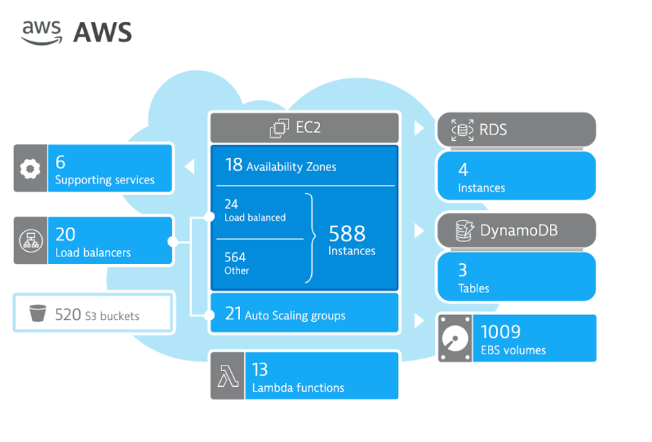

### Hosts regional page 

Notice the following details:
1. A summary of type and status is shown
1. A running average for virtual machines
1. A table of host with AWS monitor metrics summarized.  Notice that both hosts with and without an OneAgent are both shown

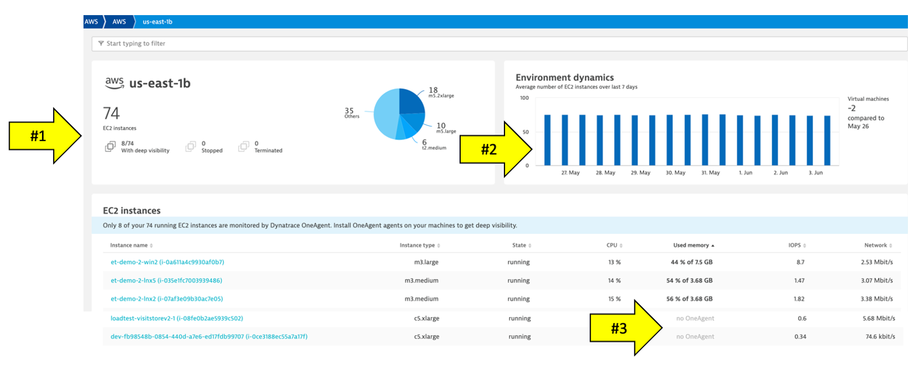

### EC2 example

Here is an example of a host with no OneAgent.

Notice the following details:
1. Expand the properties to see more details
1. All the AWS CloudWatch metrics are viewable as time-series data

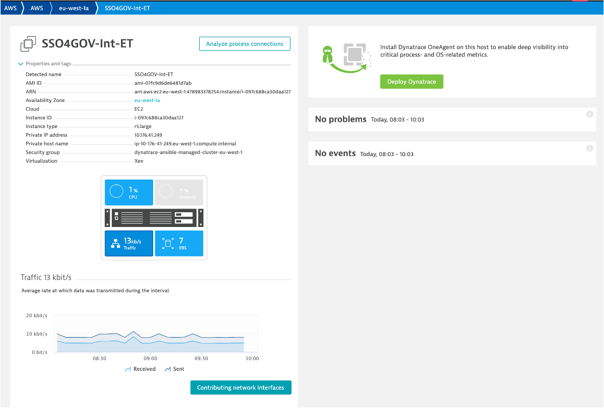

### Lambda example

Here is a list of the Lambda functions.  Notice tags and time-series data.

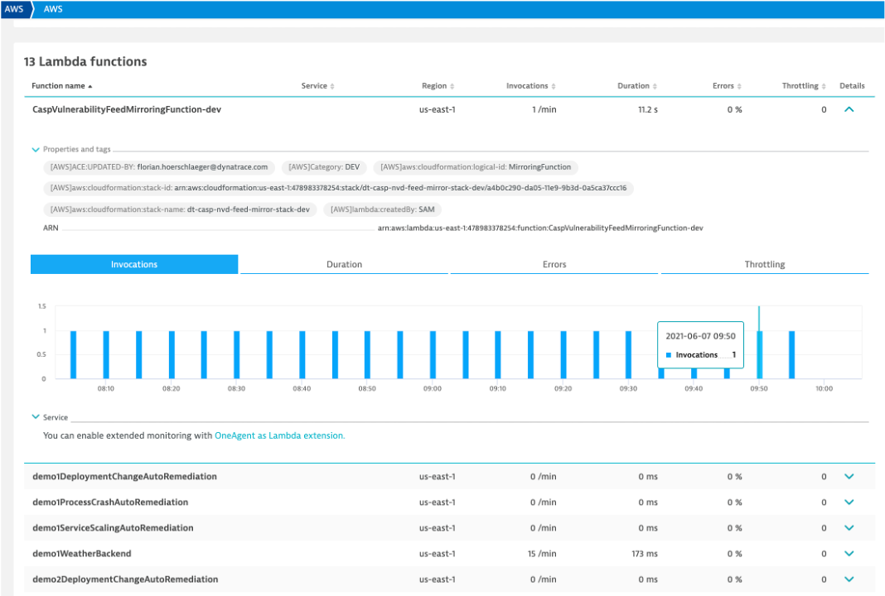

### Preset dashboards

As AWS services are enabled, Dynatrace will enable preset dashboards automatically.  These can be cloned and customized or hidden as required.  Here is one example:

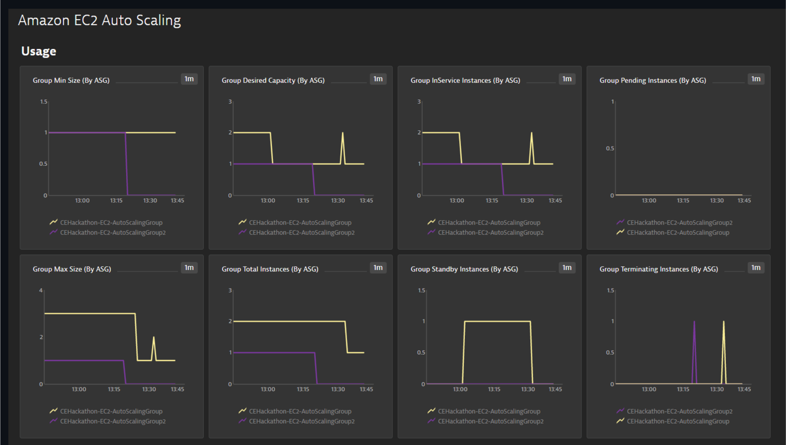

To see more dashboards, navigate to this repository:
* [https://github.com/Dynatrace/snippets/tree/master/product/dashboarding/aws-metric-streaming](https://github.com/Dynatrace/snippets/tree/master/product/dashboarding/aws-metric-streaming){target="_blank"}

## Lab Setup:  We will not execute this part of the lab as we have automated the creation of a proxy known as the Dynatrace Activegate and creating the necessary AWS policies and roles that are needed for the Cloudwatch configuration. You can see all the magic in the Git repo you copied in Lab 0 in the provision-scripts/provision-workshop.sh file.  However we will show you the steps so you are familiar and can reference them should you need them for other purposes. Hands on will resume on step 3 of this lab.

There are [several ways](https://www.dynatrace.com/support/help/setup-and-configuration/setup-on-cloud-platforms/amazon-web-services/aws-monitoring-with-dynatrace-managed){target="_blank"} one can configure the Dynatrace AWS monitor, but for this workshop we will use a `quick` solution using AWS `role` based access by creating and executiung a `Cloud Formation Template` by following these basic steps:

1. Download the Dynatrace_Monitoring_Role file from the github repository
1. Create AWS Role for monitoring
1. Create Dynatrace AWS connection with role based acces 

### Step 1 of 3: Download the Dynatrace_Monitoring_Role file from the below github repo

```
https://github.com/dt-alliances-workshops/aws-modernization-dt-orders-setup/blob/main/provision-scripts/cloud-formation/dynatrace-role-access.yaml
```
1.  Copy the contents of the script by clicking on the copy button
2.  Paste the contents in a fresh notepad and save it as `dynatrace-role-access.yaml` in your desktop

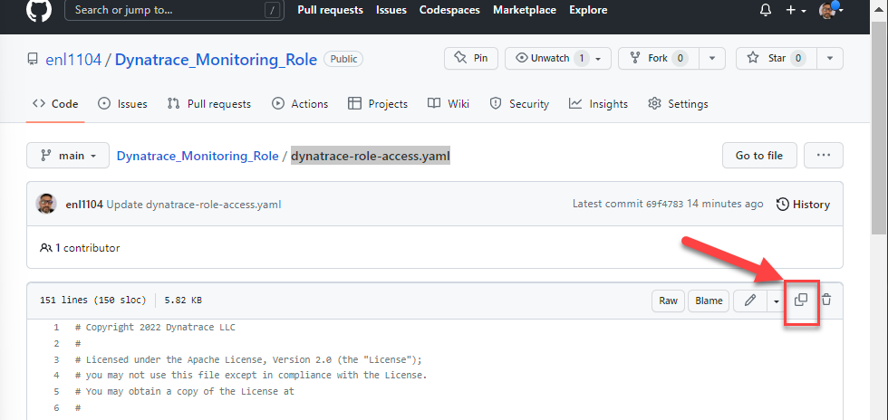


### Step 2 of 3: Create AWS Role for monitoring

The AWS monitoring role defines the minimum scope of permissions you need to give to Dynatrace to monitor the services running in your AWS account. Create it once and use anytime when enabling Dynatrace access to your AWS account.

1 . From your amazon console home type `cloudformation` and select `Stacks`.

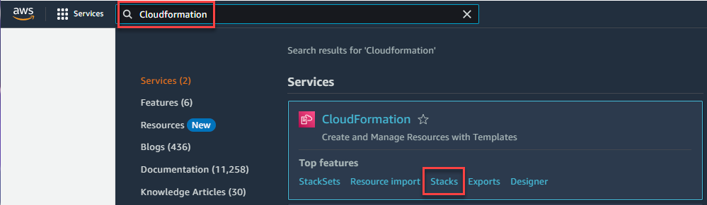

2 . Select the `Create stack` dropdown and click on `With new resources (standard)`.

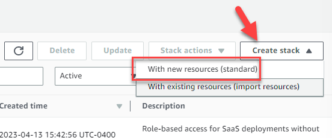

3 . On the `Create stack` page, select radio buttons for `Template is ready` and `Upload a template file`.

4 . Next, Click the `Choose file` button and select the `dynatrace-role-access.yaml` file you saved in the earler step. 

5 . Click on `Next`.

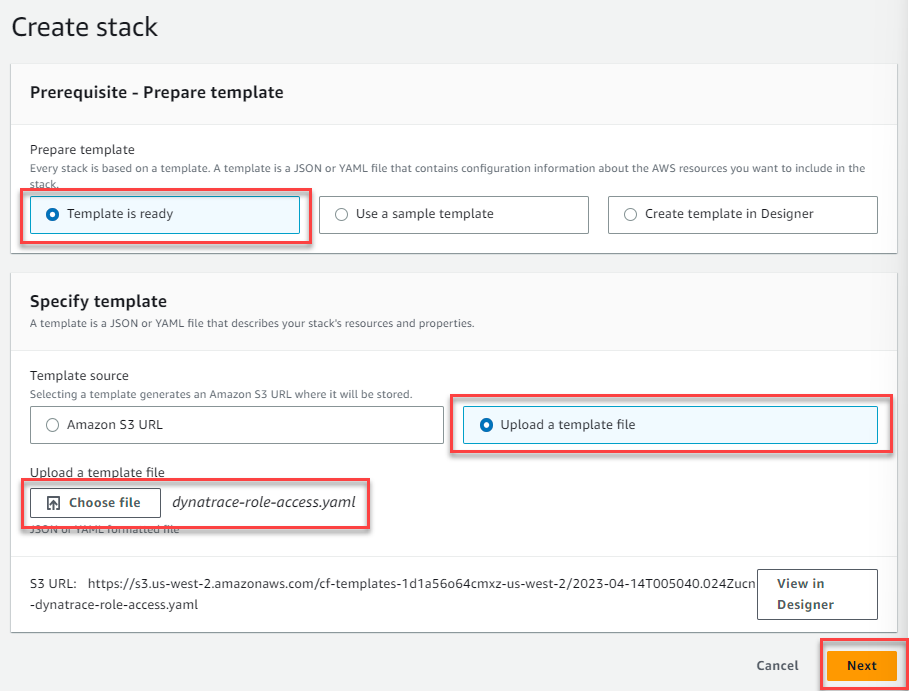

6 . On the `Specify stack details` enter the `stack name` as `DT-monitoring-role` and in the `Parameters` section paste the `ExternalID` you copied earlier from the Cloud and Virtualizatoin -> AWS integration page in the Dynatrace platform and click `next`.

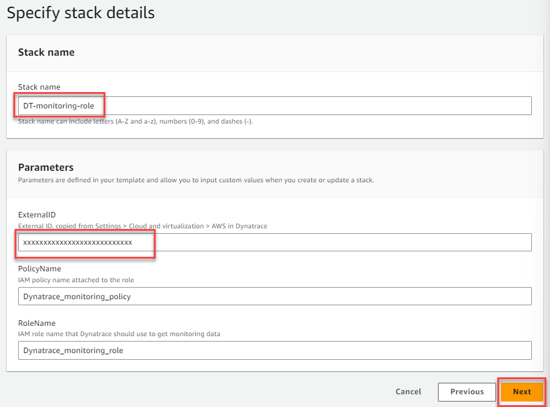
 
7 . On the `Configure stack options` click `Next`.

8 . On the `Review DT-monitoring-role` notice the parameters fileed out with your info including the `ExternalID`.  Finally, aknowledge and `Submit`.

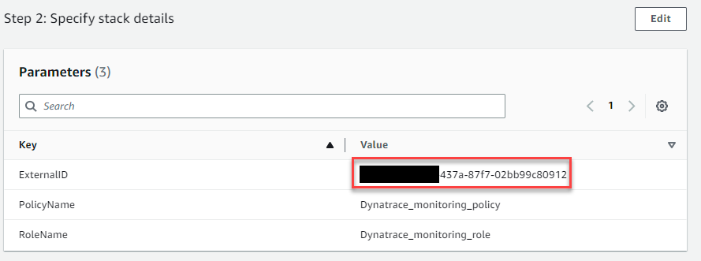
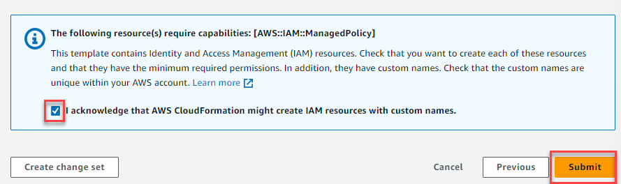

9 . On the Stacks page you will see the `Create_Complete` message in the status.


### Step 3 of 3: Create Dynatrace AWS connection with role based acces

Dynatrace can use role based access to make secure REST or Query protocol requests to the AWS service API. You'll now need to return to the Dynatrace portal to finalize your integration and make the connection that it can use to get metrics from Amazon Web Services.

1. From the Cloud and Virtualizatoin -> AWS integration page on the Dynatrace portal add the following bits of information:  
    1.  Connection Name: `Dynatrace Integration`
    2.  IAM Role: `Dynatrace_monitoring_role`
    3.  Your AWS account ID:  found on the AWS console top right hand dropdown.
    4.  Click `Connect`

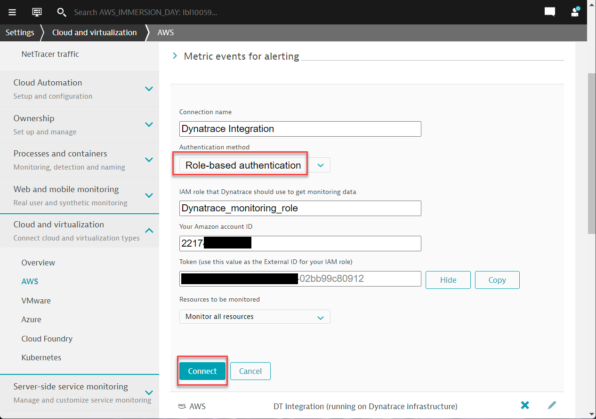


2. Once the connection is successfully `verified` and saved, your AWS account will be listed in the `Cloud and virtualization` settings page. If successful, your should see the configuration now on the `AWS connections` page:

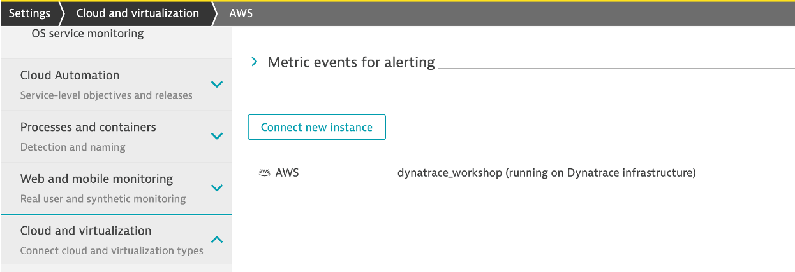

## Review AWS monitor

On the far left Dynatrace menu, navigate to the `Infrastructure -> AWS` menu.

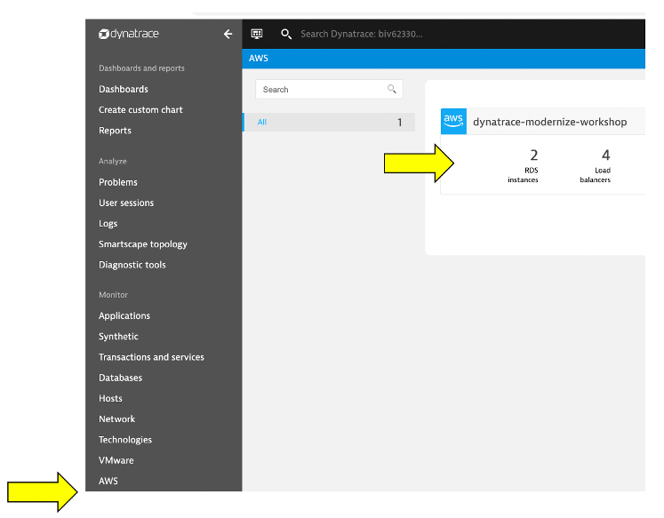

You may see `no data` initially as seen here. This is because Dynatrace makes Amazon API requests every 5 minutes, so it might take a few minutes for data to show until we are done with application setup on AWS.

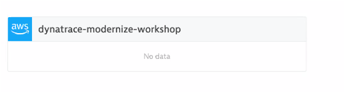

Once data is coming in, the dashboard pages will look similar to what is shown below.

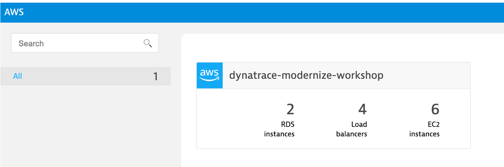

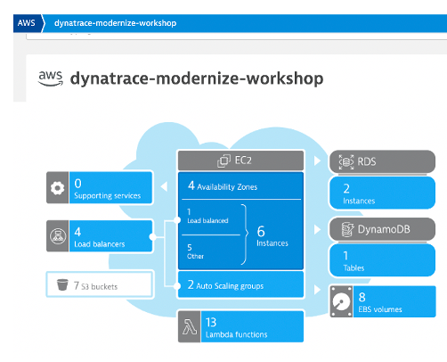

### Review collected metrics

Once data starts to be collected, click in the blue availability zone section located under the grey header labeled EC2 and you should see the list of availability zones below. Click on `us-west-2c` and the EC2 instances will be listed.

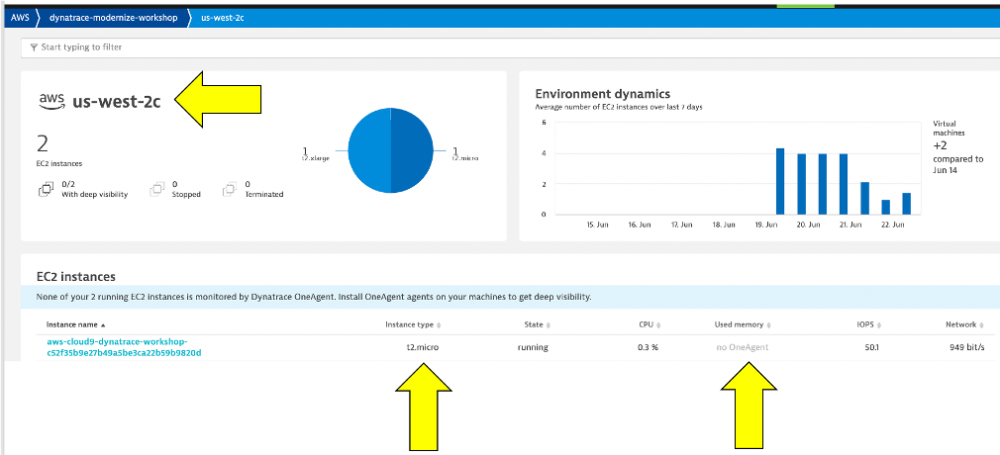

Click on an EC2 instance, and you will see how this host still is represented in the same Host view that we saw earlier with the host running the OneAgent. The basic CPU and memory metrics from CloudWatch are graphed for you. What is GREAT, is that this host is being monitored automatically by the Dynatrace AI engine and can raise a problem when there are anomalies.

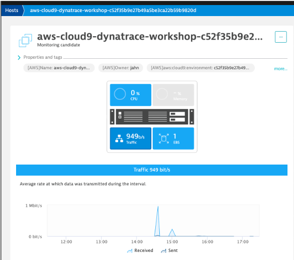

### 👍 How this helps

The AWS monitor is a central way to get a picture and metrics for the AWS resources running against your accounts as you migrate.

Read more about how to scale your enterprise cloud environment with enhanced AI-powered observability of all AWS services in [this Dynatrace blog](https://www.dynatrace.com/news/blog/monitor-any-aws-service/){target="_blank"}

### 💥 **TECHNICAL NOTE** 

<i>See the [Dynatrace Docs](https://www.dynatrace.com/support/help/technology-support/cloud-platforms/amazon-web-services/aws-monitoring-with-dynatrace-saas/){target="_blank"} for more details on the setup options.</i>

## Custom Metrics Events

Dynatrace Davis automatically analyzes abnormal situations within your IT infrastructure and attempts to identify any relevant impact and root cause. Davis relies on a wide spectrum of information sources, such as a transactional view of your services and applications, as well as all on events raised on individual nodes within your Smartscape topology.

There are two main sources for single events in Dynatrace:

* Metric-based events (events that are triggered by a series of measurements)
* Events that are independent of any metric (for example, process crashes, deployment changes, and VM motion events)

Custom metric events are configured in the global settings of your environment and are visible to all Dynatrace users in your environment.

### 1. Setup Custom metric alerting for AWS

1 . To add custom alerts, navigate to `Settings --> Anomaly Detection --> Metric events` menu. 

2 . Click the `Add metric events` button.

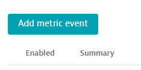

3 . Fill in the below information on the `Add metric event` template
1.  Summary:  `CPU % percentage`
2.  Type:  `Metric key` from dropdown
3.  Metric key `EC2 CPU usage %` from dropdown
4.  Agregation `Average` from dropdown
5.  Management zone `dt-orders-monolith`
6.  under entities click on `>` to see `Dimension key of entity type` and select `EC2 instance` from dropdown

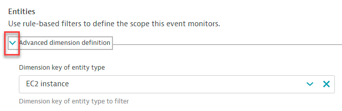

7.  Dymension filter click on `Add dimension filter` and select as shown below.

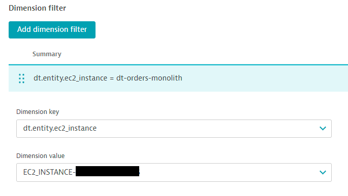

8.  under Monitoring strategy section select as shown.

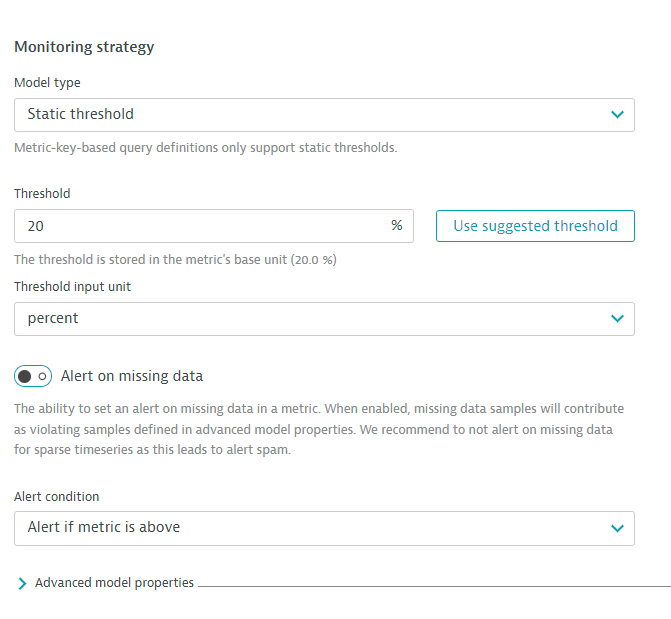

9.  select the `>` next to `Advanced model properties` and input as shown.

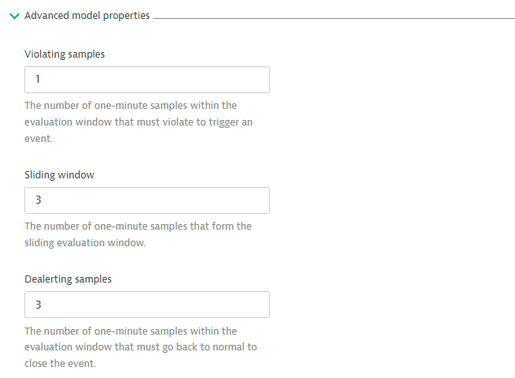

10. In the `Event template` section add:
    1. Title:  `CPU CUSTOM ALERT`
    2. Event type from dropdown:  `Custom alert`
    3. Dimension key of entity for events select `EC2 instance` from dropdown

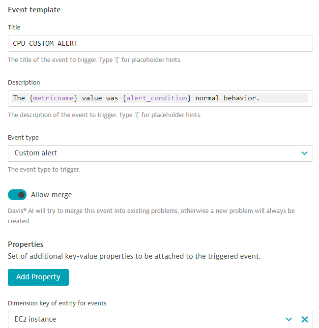

11. click on `Save Changes`

4 . Add another rule, with everything the same, except for the `Event Description` to have the `title` as `CPU Resource Alert` and `Event type` = `RESOURCE` as shown below. 
  1. toggle the `Alert on missing data` to `off`

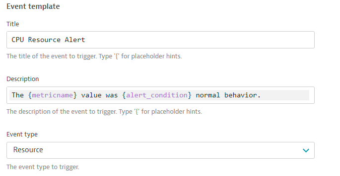

5 . Save your changes and the list should look as shown below.

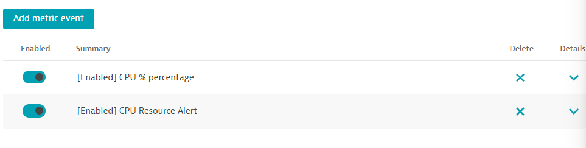

## Trigger Custom Problem Alerts

### 1. SSH to monolith host 

To connect to the host, simply use `EC2 Instance Connect`.  To this, navigate to the `EC2 instances` page in the AWS console.

From the list, pick the `dt-orders-monolith` and then the `connect` button.

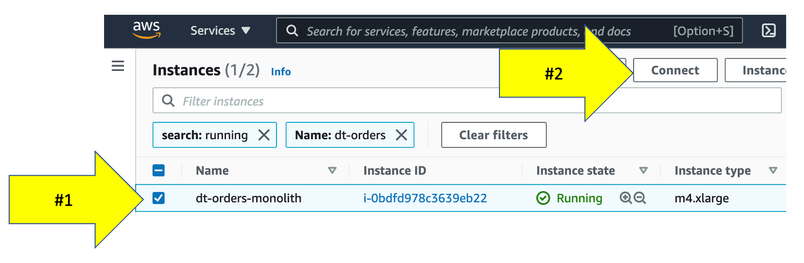

Then on the next page, choose the `EC2 Instance Connect` option and then the `connect` button.

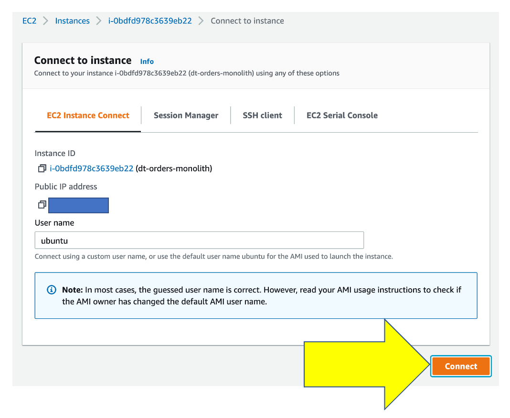

Once you connected, you will see the terminal prompt like the below.

```
Welcome to Ubuntu 20.04.2 LTS (GNU/Linux 5.4.0-1045-aws x86_64)
...
...
To run a command as administrator (user "root"), use "sudo <command>".
See "man sudo_root" for details.
ubuntu@ip-10-0-0-118:~$ 
```

### 2. Trigger a CPU problem

Using a unix utility [yes](https://linuxconfig.org/how-to-stress-test-your-cpu-on-linux){target="_blank"}, we can generate CPU stress just by running the `yes` command a few times.

In the terminal, copy all these lines and run them:

```
yes > /dev/null &
yes > /dev/null &
yes > /dev/null &
```

To verify, run this command:

```
ps -ef | grep yes
```

The output should look like this:

```
ubuntu    5802  5438 99 20:48 pts/0    00:00:05 yes
ubuntu    5805  5438 89 20:48 pts/0    00:00:04 yes
ubuntu    5806  5438 97 20:48 pts/0    00:00:03 yes
ubuntu    5818  5438  0 20:48 pts/0    00:00:00 grep --color=auto yes
```
3 . Back in Dynatrace within the `host` view, the CPU should now be high as shown below

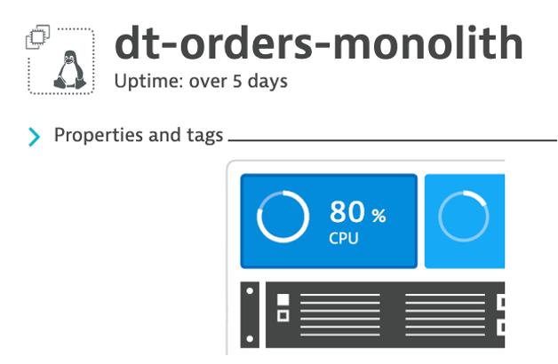

4 . It may take a minute or so, but you will get two problem cards as shown below.  #1 is the alert from the `severity = RESOURCE` where Davis was invoked, and #2 is the alert from `severity = CUSTOM ALERT`.

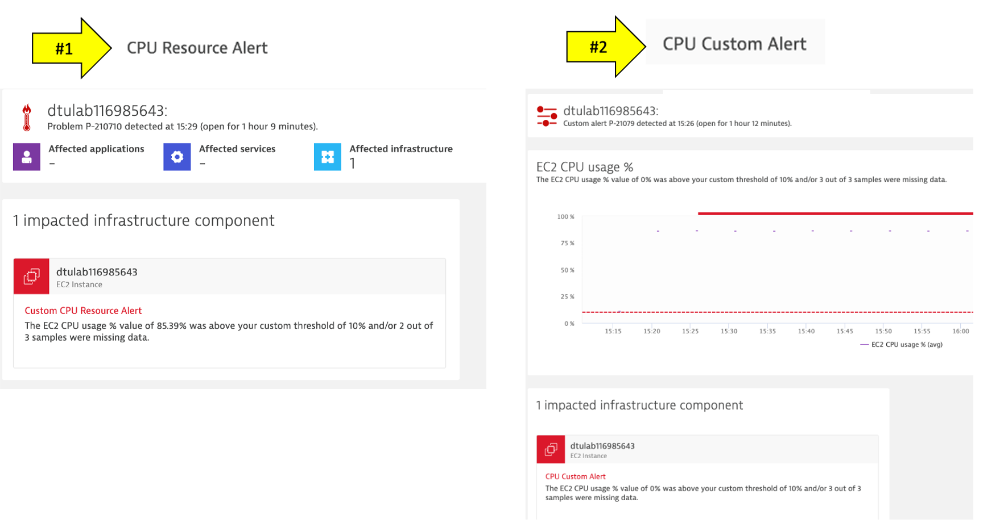

### 3. Review Problem Notifications

1 . Navigate to `Settings --> Integrations --> Problem Notifications` 

2 . Read the overview and then click the `Add Notification` button

3 . Click various `Notification types` from the drop down to review the configurations inputs.

4 . For the `Custom integration` type, review the option to customize the payload.

5 . Notice how you can choose the `Alert profile`, but you only have default

### 4. Review Alerting Profiles

1 . Navigate to `Settings --> Alerting --> Alerting profiles`

2 . Read the overview and then expand the `default` rule.

3 . Now add one, by clicking on the `Add alerting profile` button

4 . Review the options to choose severity rules and filters

### 5. Stop the CPU problem

To stop the problem, you need to `kill` the processes.  To do this:

1 . Back in the CloudShell, run this command to get the process IDs `ps -ef | grep yes`

2 . For each process, copy the process ID and run `kill <PID>`

For example:

```
# If output is this...

ubuntu@ip-10-0-0-118:~$ ps -ef | grep yes
ubuntu    5802  5438 99 20:48 pts/0    00:00:05 yes
ubuntu    5805  5438 89 20:48 pts/0    00:00:04 yes
ubuntu    5806  5438 97 20:48 pts/0    00:00:03 yes

# Then run...

kill 5802
kill 5805
kill 5806
```
Or use the below command to kill all the PID's at once
```
kill $(ps -ef | grep yes | awk '{print $2}' | sed '$d')
```

3 . Verify they are gone by running this again `ps -ef | grep yes`

4 . Verify that CPU in Dynatrace goes to normal and the problems will eventually automatically close

### 6. Exit the SSH

Simply type `exit` to exit the VM and return the CloudShell.

### 💥 **TECHNICAL NOTE** 

* Alert configuration is available through the [Anomaly detection—metric events API](https://www.dynatrace.com/support/help/dynatrace-api/configuration-api/anomaly-detection-api/anomaly-detection-api-metric-events/){target="_blank"}. Using the API, you can list, update, create, and delete configurations.

## Summary

In this section, you should have completed the following:

✅ Review how Dynatrace integrates with [AWS CloudWatch](https://aws.amazon.com/cloudwatch/){target="_blank"}

✅ Review how [AWS CloudWatch](https://aws.amazon.com/cloudwatch/){target="_blank"} metrics can be configured as [Metric events for alerts](https://www.dynatrace.com/support/help/how-to-use-dynatrace/problem-detection-and-analysis/problem-detection/metric-events-for-alerting/){target="_blank"}

### AWS Control Tower

The Dynatrace integrated solution for AWS Control Tower provides a way to establish Dynatrace monitoring for multi-account AWS environments. This solution automates the configuration process when AWS managed accounts are created. By ingesting metrics published to Amazon CloudWatch (Watch) for databases, networks, and compute services, Dynatrace provides a picture of your environment.  

You can read more about this on this [AWS Marketplace blog](https://aws.amazon.com/blogs/awsmarketplace/increasing-observability-in-your-aws-control-tower-landing-zone-with-dynatrace/)s
