# Azure Grail Workshop Lab 0 - Setup

## Learning Objectives

We will now setup Dynatrace, Azure, and the workshop environment. You need all of these in place before you are presented with the lab excercises.

### What you'll learn in this section
<!-- Duration: 2 min -->
🔷 Setup your temporary Azure subscription from the Azure Pass promo code you received from workshop staff.

🔷 Automatically provision workshop environment and sample application

## Azure Pass Subscription Setup
<!-- Duration: 4 min -->
To complete this workshop, you will be provided an Azure Pass Promo code.  A workshop staff will provide that code to prior or during the day of the workshop.

That Azure Pass Promo code enables you to have a separate Azure subscription setup under a separate account to provision all the resources needed to complete the workshop.     

This free Azure subscription will be available to you for the next 5 days or until when the $100 credit is utilized by the Azure resources (whichever comes first).


### Tasks to complete this step

1. To setup your workshop using free Azure Pass subscription, navigate to [Microsoft's Azure Pass website](https://www.microsoftazurepass.com/){target="_blank"}
2.  Click on Start.
    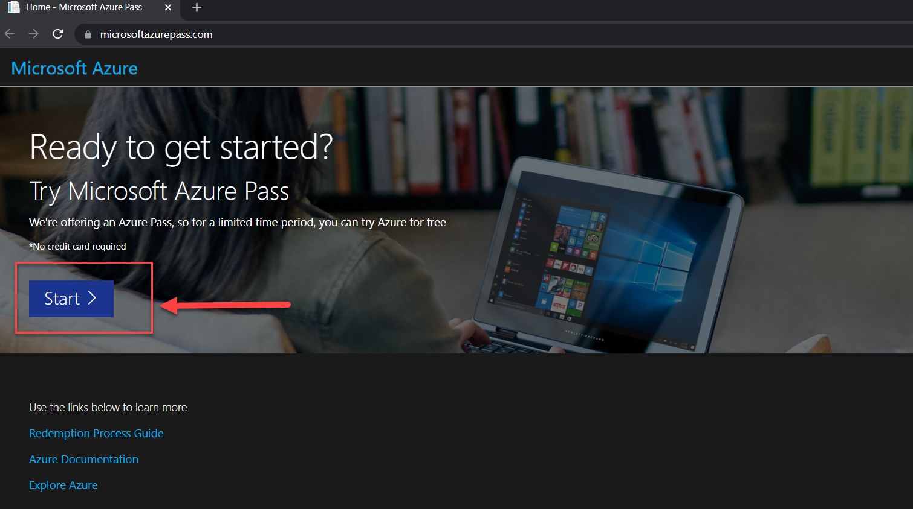
3. Use a ***personal email address*** to signin or create a new Microsoft account email.
    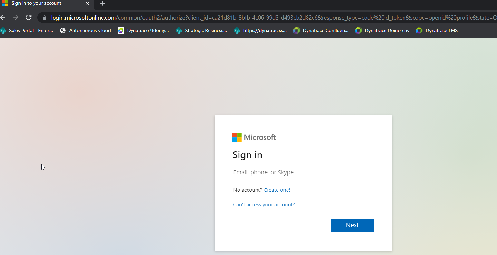
    !!! warning
    If you are signed in on a Azure account via your **corporate email**, please signout and login using your personal account or create a new account shown below.

     <br>   

4.  Confirm the email address you want to use for your Azure pass subscription and "promo" code provided to allow for the Azure subscription to be setup.
    
    !!! tip
    ℹ️   Provisioning your Azure subscription can take upto 5 minutes to process.           
    

<!--
!!! tip
    🏫 - Please update the Tracking Spreadsheet upon completing this task. 
-->

## Create Azure Native Dynatrace Service from Marketplace  
<!-- Duration: 3 min -->
For this workshop, we will set-up a free Dynatrace Azure SaaS tenant with an temporary license complete with all the features of our all-in-one performance monitoring platform to monitor Azure resources and complete the workshop exercises.

### Tasks to complete this step

1) Open up browser and go to Azure Portal - [https://portal.azure.com/ ](https://portal.azure.com/){target="_blank"}
    - Search for Marketplace from the top search bar     
        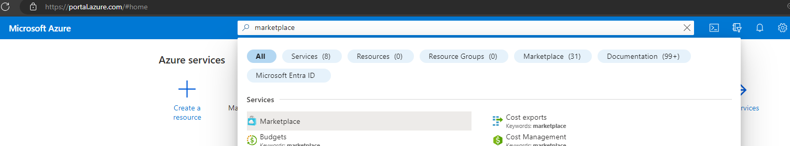
    - Once in the Azure Marketplace, search for `Azure Native Dynatrace Service` click on tile when the search displays the results.
        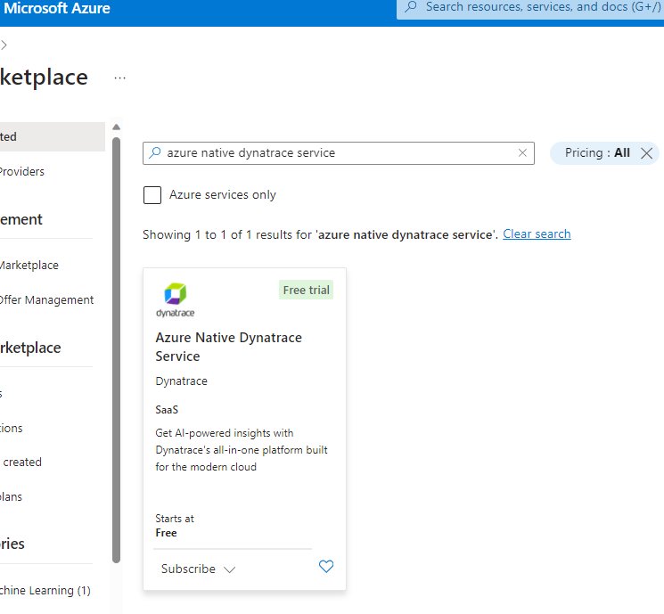
    - From the drop-down under plan, select `Dynatrace for Azure Trial` and click on subscribe
        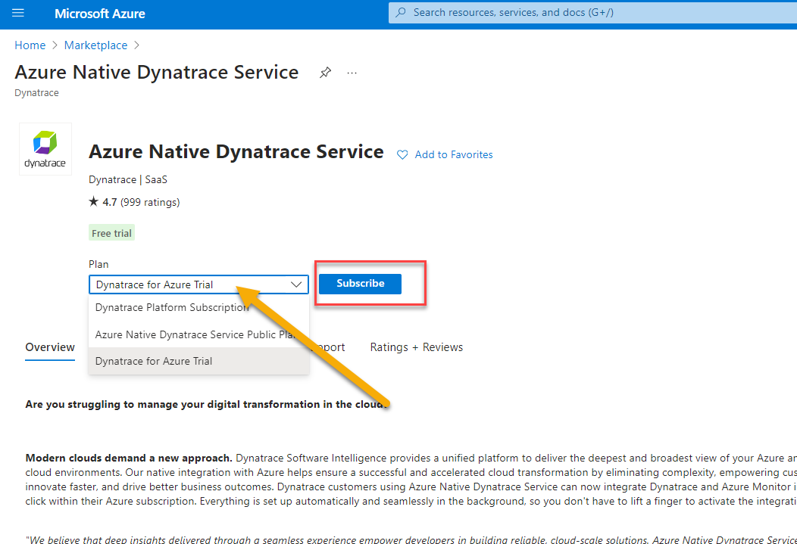
    - Click on "Create" a new Dynatrace environment
        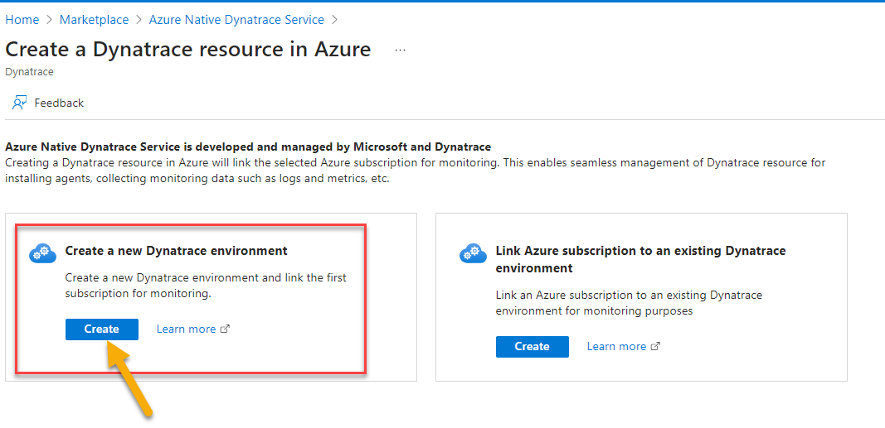
    - On the create Dynatrace environment screen (Basic's)
        - Select the `Azure Pass - Sponsorship` subscription
        - create a new resource group called `azure-native-dynatrace`
        - fill in the resource name as `dt-trial`
        - The rest of the settings can take the defaults
        - Click on "Review + Create" button
            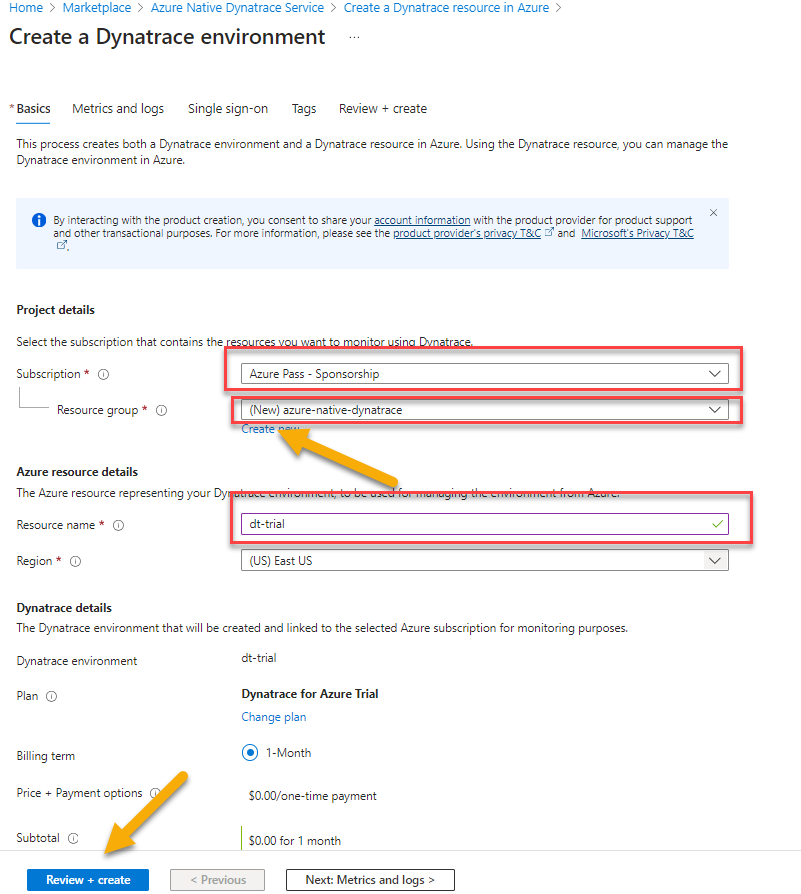
        - On the next screen click on "Create" button
            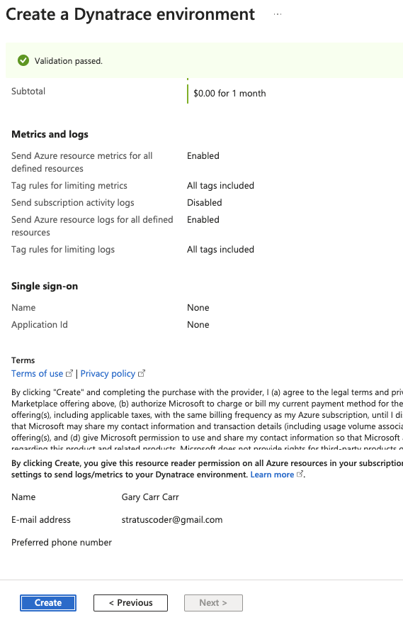
        - It will take 3-5 minutes for the deployment to complete.  Once the deployment comples successfully, your screen should reflect as below.  Click on `Go to resource` button
            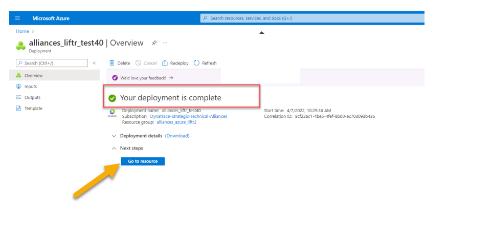

## Azure Portal Prep
<!-- Duration: 4 min -->
### Tasks to complete this step

1. Navigate to [https://portal.azure.com/ ](https://portal.azure.com/){target="_blank"}

2. Click on the Cloud Shell button
    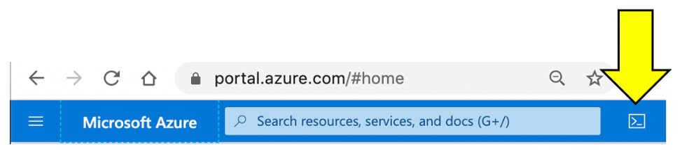

    !!! tip
    If you get this prompt, choose bash.  

    

    <br>!!! tip
    If you get the prompt below, choose `Azure Pass - Sponsorship` and then click the `Create Storage` button.

    
    

    
    !!! tip
    Creating the storage will take a couple of minutes.**

    3. Once the storage is created, you should see the Unix bash shell.
    

    4. Make a dedicated Azure shell Browser tab by clicking this new tab icon.
    

    5. To verify which subscription is configured for the Azure CLI, run this command.
        ```console
          az account show
        ```

    - Look for the name in the output. This is example when a promo code was used.

        ```
          {
            "environmentName": "AzureCloud",
            "homeTenantId": "xxx-xxx-xxx-xx-xxx",
            "id": "yyy-yyyy-yyy-yyy-yyy",
            "isDefault": true,
            "managedByTenants": [], 
            "name": "Azure Pass - Sponsorship",   <----- This is the active subscription
            "state": "Enabled",
            "tenantId": "zzz-zzz-zzz-zzz-zzz",
            "user": {
              "name": "name@company.com",
              "type": "user"
            }
          }
        ```

        <aside class="positive"> 💻 If the subscription is not `Azure Pass - Sponsorship`, run the command below to see all the subscriptions for your user id. If this is the first time using Azure portal or a trial, then you should only have one subscription. 

    ```
    az account list --output table
    ```

- Here is an sample output:

    ```
      Name                                     CloudName    SubscriptionId                        State    IsDefault
      ---------------------------------------  -----------  ------------------------------------  -------  -----------
      Subscription 1                           AzureCloud   aaaaaaaa-aaaa-aaaa-aaaa-aaaaaaaaaaaa  Enabled  False
      Subscription 2                           AzureCloud   bbbbbbbb-aaaa-aaaa-aaaa-aaaaaaaaaaaa  Enabled  False
      Subscription 3                           AzureCloud   cccccccc-aaaa-aaaa-aaaa-aaaaaaaaaaaa  Enabled  False
      Subscription 4                           AzureCloud   dddddddd-aaaa-aaaa-aaaa-aaaaaaaaaaaa  Enabled  False
      Azure Pass - Sponsorship                 AzureCloud   eeeeeeee-aaaa-aaaa-aaaa-aaaaaaaaaaaa  Enabled  True
    ```

- If the `Azure Pass - Sponsorship` is not the `IsDefault = True`, then run these command to set and verify.

    ```
      # set the subscription
      az account set --subscription <YOUR PROMO SUBSCRIPTION ID>

      # verify change
      az account list --output table

      # double check with
      az account show
    ```

6. Within your Azure Cloud Shell window, run this command to download the workshop scripts:
    ```
      git clone https://github.com/dt-alliances-workshops/azure-modernization-dt-orders-setup.git
    ```
7. To validate all the workshops scripts have download, please run these commands within the Azure Cloud Shell window to display the directories
    ```
      cd azure-modernization-dt-orders-setup/
      ls -al
    ```
- You should see an output similar to the one below 
 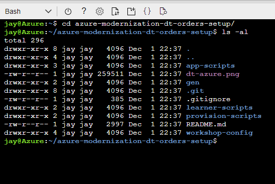


<!--
!!! tip
    🏫 - Please update the Tracking Spreadsheet upon completing this task. 
-->


## Setup your Dynatrace Environment

In this section, we'll Access the new UI for Grail

Also, we'll setup a access token within your Dynatrace envrionment that will be used by the provisioning script to configure Dynatrace automatically via the API.


### Access the new UI with Grail

1. Open up browser and go to Azure Portal - [https://portal.azure.com/ ](https://portal.azure.com/){target="_blank"}
    - Search for Dynatrace azure resource `dt-trial` from the top search bar     
        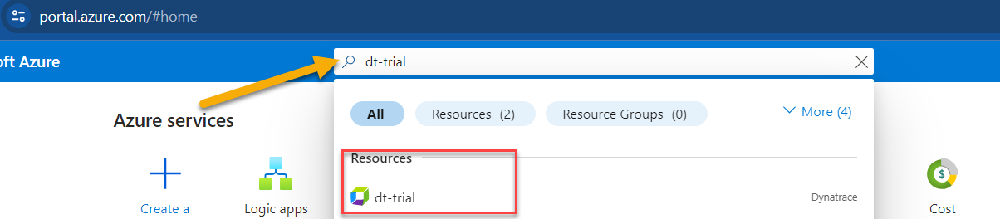
    - Click on Go to Dynatrace Link 
        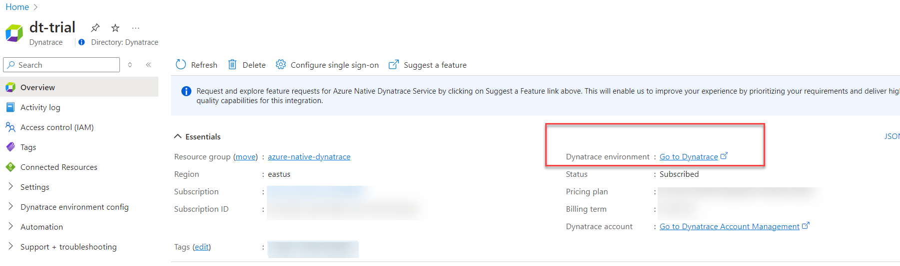

1. Login to Dynatrace
    !!! tip

        💡To login to Dynatrace you will need your Dynatrace account password.


1. On the Left menu, you'll notice a banner to access the new UI that was introduced with Grail.  
  - Click on `Take a look` button to access the new UI.
    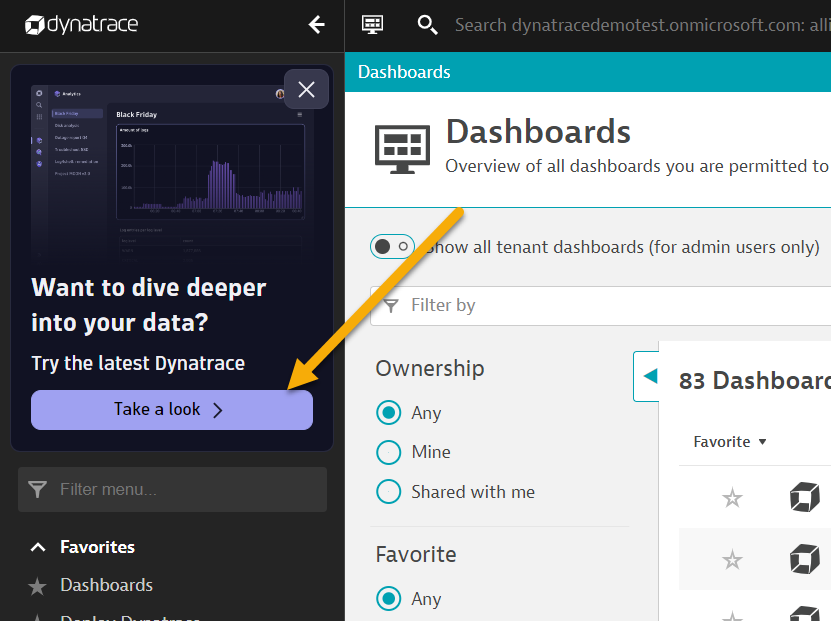
  - Click on `Tru the latest Dynatrace`
    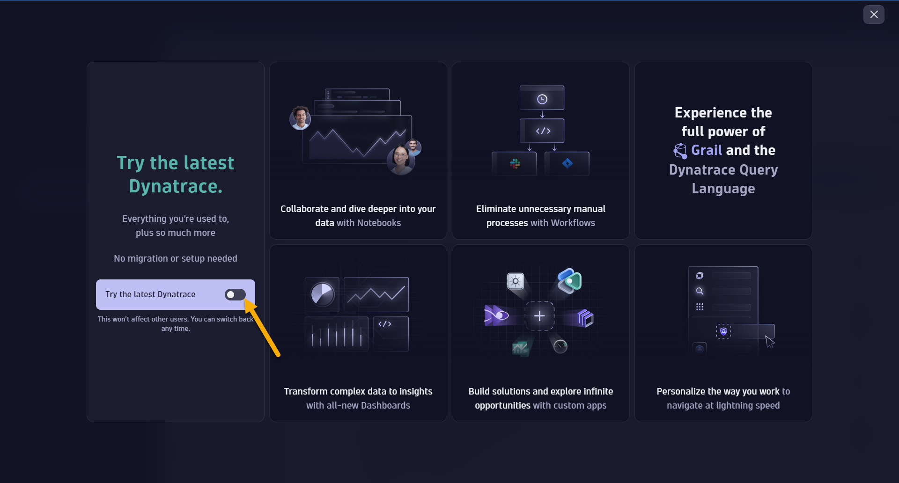
  - Click on `Get started`
1.  You are now accessing the new UI with Grail.
    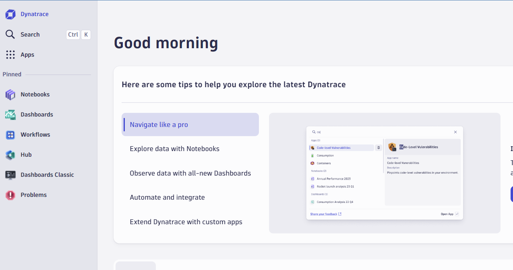


### Create Dynatrace Access Token

All we wanted to do here, is quickly get a Dynatrace token and save it for use in the Lab setup.  To capture the token, follow these steps:

1. Login into Dynatrace

1. From the Left menu, click Apps -> Choose the `Access Tokens` app. 

    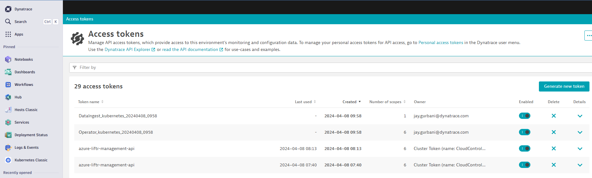

1. On the Access token page, click the `Generate new token` button

1. On the new token page, Enter a name like `azure-workshop`

1. Add `Write API Tokens` to the scope.

1. Click on Generate token button on the bottom.

1. Since this token is only shown once and you will need it in the next labs, copy this value to a local TEXT file before you leave this page. (For example Notepad, Notepad++, Notes.app)

    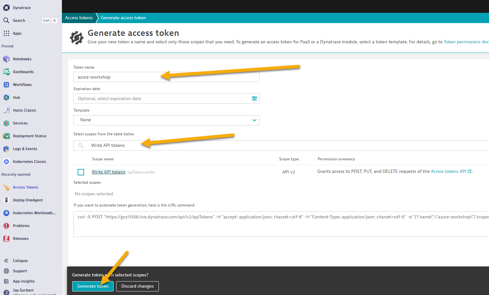

1. You will use this token in the next step as you setup the lab resources.

## Collect Inputs for Provision Script

The next steps of this guide will have you gather various information from your Dynatrace environment needed to configure your environment and for the lab exercises.

!!! tip

    📓 The next set of steps assume that your Dynatrace tenant is fully provisioned and you are logged into it.

From your Dynatrace environment, you will capture:

* Dynatrace Base URL
* Dynatrace API token

!!! tip


    - The **Base URL** will be in the Dynatrace tenant URL such as: https://[ENVIRONMENT ID].apps.dynatrace.com/.
    - The **Access API Token** will the token generated in the previous step when you setup your Dynatrace envrionment.
    - The **Azure Subscription** ID will be Azure Portal -> Search for subscriptions at the top and select the `Azure Pass` subscription.

### Capture Inputs Script

In the code repo you cloned, there is a simple UNIX shell script that prompts for values and writes them to a file called `gen/workshop-credentials.json`. Later in the labs, there are a few other simple UNIX shell scripts that will automate the step that reads this file so that you don’t need to type or copy-paste these values over and over again during the workshop.

  !!! tip

    📓 If you mess up, just click [enter] through the rest of the values and save it at the ending prompt.  You can then just re-run the script and the script will prompt you again to re-enter each value showing you each current value that it saved.


### Lets begin..

1. Run the input credentials Unix script

  ```
  cd ~/azure-modernization-dt-orders-setup/provision-scripts
  ./input-credentials.sh
  ```
1. Enter in the approprite values for the three inputs
    ```
      ==================================================================
      Please enter your Dynatrace credentials as requested below: 
      Press <enter> to keep the current value
      ===================================================================
      Dynatrace Base URL              (current: ) : 
      Dynatrace Access API Token      (current: ) : 
      Azure Subscription ID           (current: ) : 
      ===================================================================
    ```
1. Confirm all of the inputs are correct 
    - 📓 There are some derived values the script generated based on your input.  
1. Once you confirm, the data is saved off `../gen/workshop-credentials.json` and will be used by the provision script in the next step.
1. Towards the end of the script it will output two things you'll want to save in a notepad session to use in Lab2 later.
    ```
      ========================================================================================================
      ***** Please save the values below in a notepad for Lab2 when we install the Dynatrace Operator on AKS Cluster ***** 
      --------------------------------------------------------------------------------------
      Dynatrace Operator & Data Ingest Token  :       dt0c01.ABC123.ABC124
      API URL for Dynatrace Tenant            :       https://dtenvid.live.dynatrace.com/api
      =========================================================================================================
    ```


## Provision the workshop
<!-- Duration: 15 min -->
This step will automatically provision several Azure resources and Dynatrace configuration needed for the workshop via a shell script.  

The process to provision everything will take ~15-20 minutes.

### What exactly is this script doing?

1 . Add Azure resources

- Add a Resource Group for all the VMs named: `dynatrace-azure-grail-modernize`
<!--
- Add Service Principal: `dynatrace-azure-modernize-workshop-sp` needed for the Azure monitor integration.
- Add VM named: `dt-orders-active-gate`. At startup, it installs the Dynatrace ActiveGate process needed for the Azure monitor integration.
-->
- Add VM named: `dt-orders-monolith`. At startup, it installs Docker and the Dynatrace Orders application in the Monolith configuration. OneAgent is installed using Azure extension
- Add Azure Kubernetes Cluster named `dynatrace-azure-grail-cluster`.

2 . Set Dynatrace configuration

- Set global [Frequent Issue Detection](https://www.dynatrace.com/support/help/how-to-use-dynatrace/problem-detection-and-analysis/problem-detection/detection-of-frequent-issues/) settings to Off
- Adjust the [Service Anomaly Detection](https://dynatrace.com/support/help/platform/davis-ai/anomaly-detection/adjust-sensitivity-anomaly-detection/adjust-sensitivity-services/) global settings to a fixed error threshold
- Add [Management Zones](https://www.dynatrace.com/support/help/how-to-use-dynatrace/management-zones/) for the monolith and micro services versions of the application
- Add [Auto Tagging Rules](https://www.dynatrace.com/support/help/how-to-use-dynatrace/tags-and-metadata/) to drive management zone and SLO settings
- Add [SLOs](https://www.dynatrace.com/support/help/how-to-use-dynatrace/service-level-objectives/) for a use in custom dashboards
- Add [Azure Monitor Integration](https://www.dynatrace.com/support/help/setup-and-configuration/setup-on-cloud-platforms/microsoft-azure-services/azure-integrations/azure-cloud-services-metrics/monitor-azure-integration-service-environment)

!!! tip


    📓The Dynatrace configuration scripts use a combination of [Dynatrace Monitoring as Code](https://github.com/dynatrace-oss/dynatrace-monitoring-as-code) framework (a.k.a. monaco) and the [Dynatrace Configuration API](https://www.dynatrace.com/support/help/dynatrace-api/configuration-api/) for those few Dynatrace configurations not yet supported by monaco.

### Tasks to complete this step
1. Open up Azure Cloud shell open

1. Copy the command from below and hit enter it into your Azure Cloud shell and hit enter.  
    ```
      ./provision-workshop.sh grail
    ```

1. You should see a prompt similar to as one below.

    ```
      ===================================================================
      About to setup Dynatrace Grail Workshop
      Dynatrace Server: https://name.live.dynatrace.com
      SETUP_TYPE   = grail
      ===================================================================
      Proceed? (y/n) : 
    ```
9. Enter **y** at the prompt to begin the provisioning of the workshop.  Once the script is complete you should see output as shown below
    ```
      =============================================
      Provisioning workshop resources COMPLETE
      End: Thu 25 Nov 2021 12:45:29 PM UTC
      =============================================
    ```

## Validate workshop provisioning completed
<!-- Duration: 2 min -->
In this step we will verify if all of the Azure resources were provisioned for the workshop

!!! tip


    📓 Only proceed if the provisioning script completed with this status

      ```
      ...
      ...
      =============================================
      Provisioning workshop resources COMPLETE
      =============================================
      ```

### Tasks to complete this step
1. Go back to the window where you have the Azure Portal screen open
2. Search for `Resource Groups` from the search bar at the top

3. Click on `Resource Groups`.  From the list of resource group select `dynatrace-azure-grail-modernize`.
4. Once you're within the resource group, you will see all of the different types of resources we've automatically provisioned for this workshop
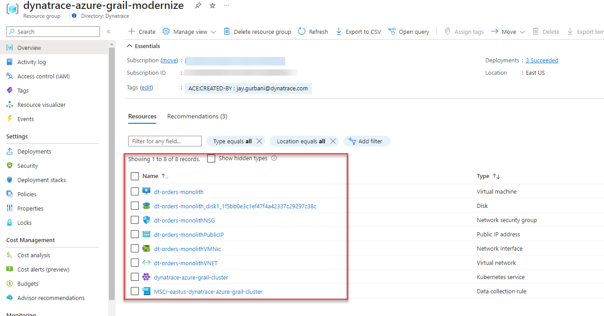

### Verify AKS Cluster is provisioned
- In this step we will verify if the Azure Kubernetes Service (AKS) Cluster was provisioned correctly. Also we will download the credentials to manage our AKS cluster via `kubectl` commands.

- The [kubectl](https://kubernetes.io/docs/reference/kubectl/overview/){target="_blank"} command line tool that lets you control Kubernetes clusters.  For details about each command, including all the supported flags and subcommands, see the [kubectl](https://kubernetes.io/docs/reference/kubectl/overview/){target="_blank"} reference documentation.

1. Run this command in Azure Cloud shell to get familiar with the command line options for kubectl.

    ```
    kubectl --help
    ```

1. Configure kubectl to connect to the new cluster by downloading the cluster credentials. 

    ```
    az aks get-credentials --resource-group dynatrace-azure-grail-modernize --name dynatrace-azure-grail-cluster    
    ```
1. Verify you are connected.  You should see `dynatrace-azure-grail-cluster` as the output.

    ```
    kubectl config current-context
    ```

1. List the nodes in the cluster

    ```
    kubectl get nodes
    ```

    The output should look like this:

    ```
    NAME                                STATUS   ROLES   AGE   VERSION
    aks-nodepool1-74092643-vmss000000   Ready    agent   21h   v1.19.11
    aks-nodepool1-74092643-vmss000001   Ready    agent   21h   v1.19.11
    ```

    You can see even more detail with this command.

    ```
    kubectl describe nodes
    ```

    !!! tip


        📓 Ensure you're able to sucessfully run all of the `kubectl` commands above.  This ensures you can sucessfully connectivity to the AKS cluster, which is key in Lab2 when we deploy the sample application to the AKS cluster in Lab2, Step 5

        </aisde>

    ### Optional Verification of AKS Cluster via Azure Portal

    - Within the Azure web portal, search for the kubernetes services and then click on the new workshop cluster.

    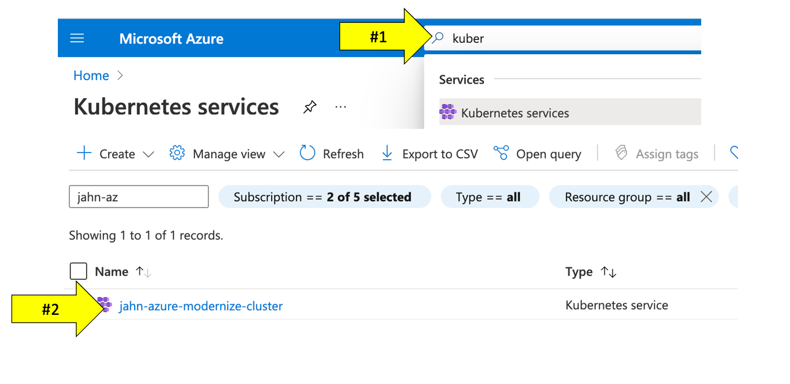

    - Explore the configuration to view the number of nodes and the kubernetes version.

    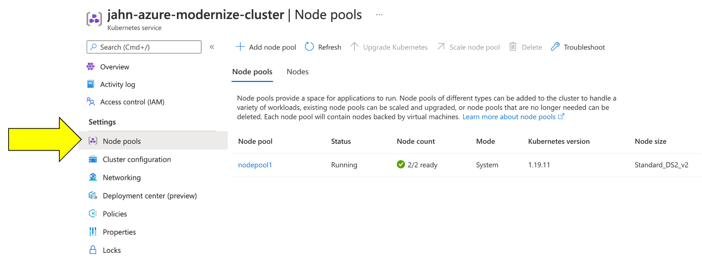
    </details>


    ## Summary
    Duration: 2

    In this section, you should have completed the following:

    ✅ Setup your Azure subscription utlizing the Azure Pass Token

    ✅ Provisioned a trail Dynatrace Grail tenant through the Azure Marketplace

    ✅ Setup the Azure Cloud Shell to run various UNIX commands

    ✅ Captured environment and token info needed for workshop provisioning automation scripts

    ✅ Provisioned workshop Azure resources

    <!--
    <aside class="positive"> 🏫 - Please update the Tracking Spreadsheet upon completing this task.   
-->
