# Azure Grail Workshop Lab 4 - Dashboards & Notebooks

## Dashboards Overview
<!-- Duration: 5 min -->
Get your first fully functional dashboard up and running in minutes with this quick guided tour. We’ll show you how to add queries, external data, markdown, and variables—without long explanations or tutorials.

With Dashboards, you can:

- Query, visualize, and observe all your data stored in [Grail](https://www.dynatrace.com/support/help/shortlink/dynatrace-grail).
- Write custom JavaScript with [ad-hoc functions](https://dt-url.net/developer-dashboards) to fetch external data.
- Annotate all your visualizations with markdown to enrich them with context.
- Add variables to filter your results and make your dashboard dynamic.

!!! tip
    Want to know more about the Dynatrace Query Language?
    🎓 [Learn DQL ](https://dt-url.net/learndql) at the Dynatrace playground. 🎓

### Tasks to complete this step
1. Open the Dashboards app from the Left Menu
1. Select `+ Dashboard`
1. Select `+` to add dashboard element    
1. Select Query Grail.
    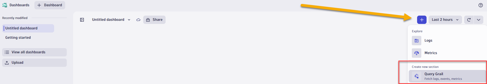
1. In the tile editor for Query, enter the following DQL
    ```
        fetch logs
        | filter cloud.provider == "azure"
        | summarize count(), by:{azure.resource.type}
        | sort `count()`, direction:"descending"
    ```
1. Select Run Query. For logs, your results will be generated in a table by default.
1. Select Select visualization tab to display the results differently.
    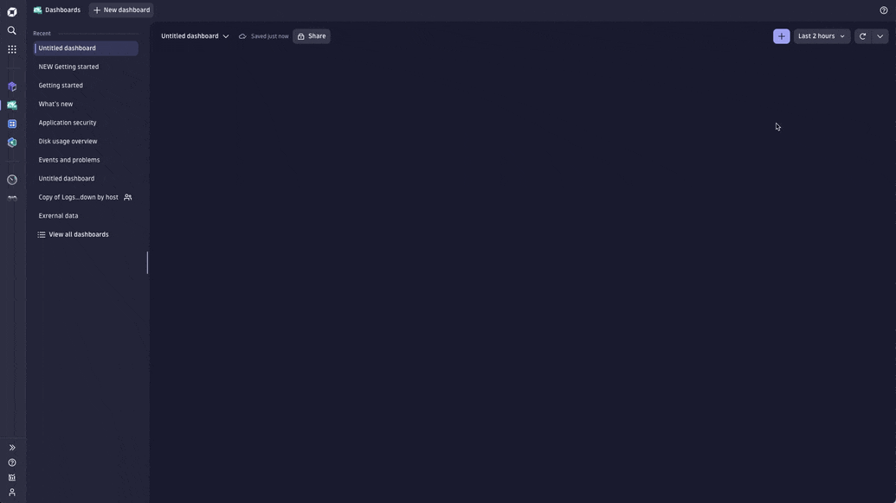

## Notebooks Overview
<!-- Duration: 5 min -->
Want to explore data and create powerful, data-driven documents for sharing and collaboration? You're in the right place. If you're already familiar with Notebooks, you can get going with an empty notebook. If you ever want to revisit this page, you’ll find it under Getting started in the (?) menu.

With Notebooks, you can:
- Query, analyze, and visualize all your observability data, including logs, metrics, and events powered by [Grail](https://www.dynatrace.com/support/help/shortlink/dynatrace-grail){target="_blank"}.
- Create and collaborate on interactive, data-driven, and persistent documents.
- Fetch and incorporate external data with ad-hoc [functions](https://dt-url.net/functions-help){target="_blank"}.
- Add markdown to provide context and bring colleagues along.

In each notebook, you can add sections of Query, Code, and Markdown. On this page, we show you how to work with each one.

### Tasks to complete this step
1. Open the Notebooks app from the Left Menu
1. Select `+ Notebook`
1. Add a query
    - Select + to open the sections menu.        
    - Select Query Grail.
        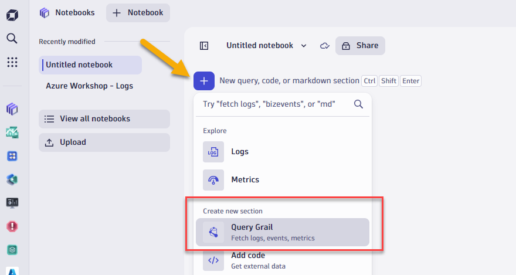
    - Type `fetch logs` for this example.
    - Adjust the timeframe, if you want. The default is the last 2 hours.
    - Then, select Run query.
    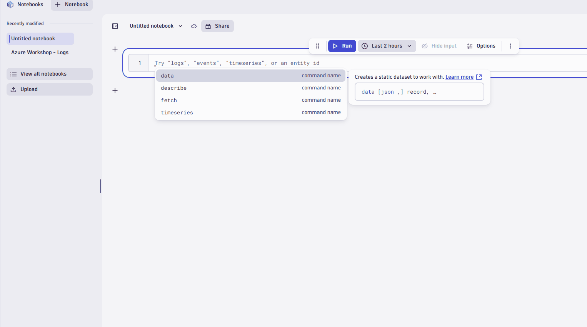
1. Use filters to refine your query
    - You can refine query results in lots of ways. Let’s try refining your query result with a simple host filter.
    - In the table, select the cell with the relevant host.
    - Select Filter.
        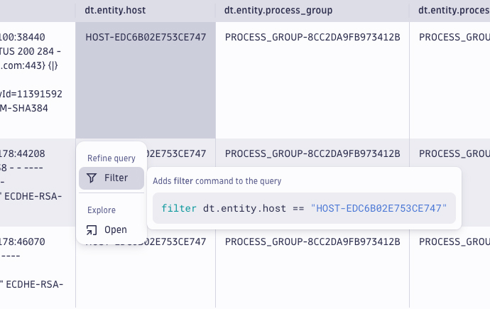
    - You just filtered your query results by the host. Nicely done. The filter only applies to the current section of your notebook
1. Now, let’s say you want summarize number of records by process group.        
        - In the `dt.entity.process_group` column, click on column header.
            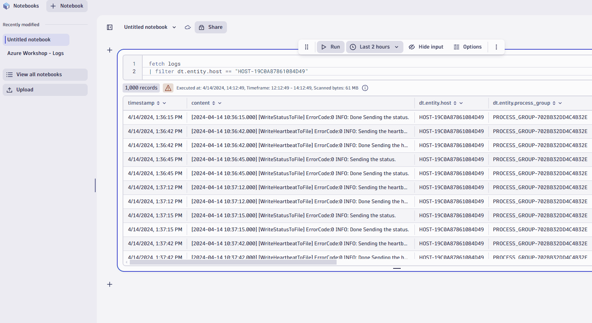
    !!! tip
    📓If you want to go further and learn more about using DQL to refine queries in Notebooks, visit [Dynatrace Query Language](https://www.dynatrace.com/support/help/observe-and-explore/query-data/dynatrace-query-language){target="_blank"}. 

3. Visualize your data in different ways
    - When you’re working with complex data, you’ll find it useful to see a record list, which is a simple list of records that contains all the fields.

    - Simply select the record list tab and you’re done.
At other times, a chart or graph may be more effective for communicating a trend, event, or insight. Dynatrace gives you a variety of options. Let’s try creating a bar chart.
        - Select Visualizations.
        - Select Change visualization.
        - Choose the Bar chart.
        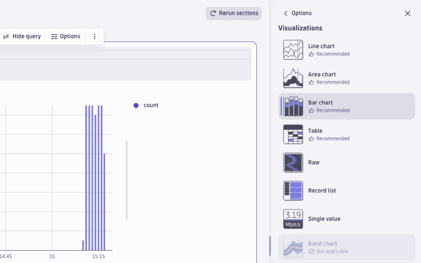
4. Add Code
    - Code sections are useful when you want to add external data to your notebook. Code sections run as a serverless function. To learn more, visit [Dynatrace functions](https://developer.dynatrace.com/preview/develop/functions/){target="_blank"}. Let’s add code using a snippet to fetch external data: Select + to open the sections menu.

        - Under Code, select Fetch external data.
        - Give the different templates a try. They’ll save you time and effort.
        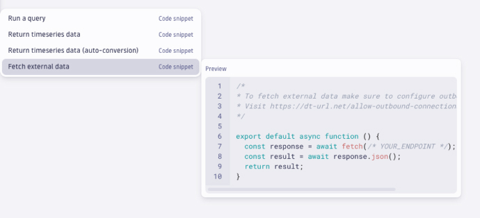

## Use DQL in Notebooks to analyze logs
<!-- Duration: 10 min -->
### Tasks to complete this step
1. Download this sample notebook we will use to analyze logs
    - Right click in browser, click `Save As`
    - Click on [ this link ](https://raw.githubusercontent.com/dt-alliances-workshops/azure-modernization-dt-orders-setup/grail/learner-scripts/AzureGrailWorkshop-Logs.json) to download the file.
        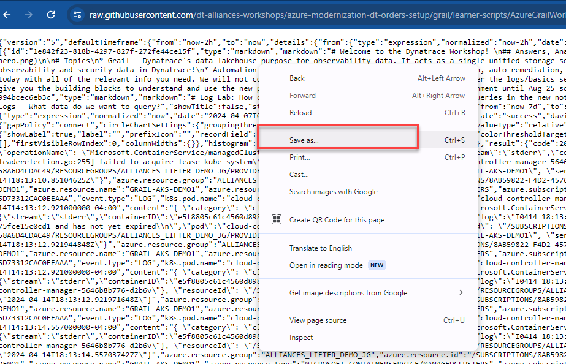
    - Save it under default filename

2. Go into Dynatrace UI, open the notebooks app from your left menu
    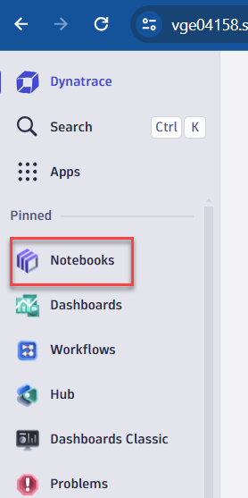
3. Expand the Notebooks menu
    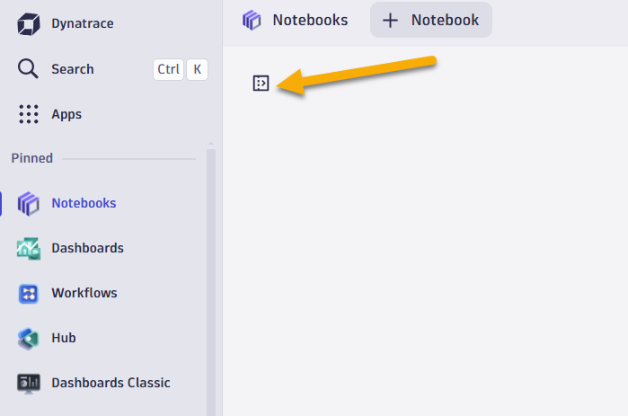
4. Click on upload and browse to the notebook JSON file where you saved.
5. Follow the instructions in the notebook to analyze log data from a Hipster shop sample app.

## Use DQL in Notebooks to analyze metrics
<!-- Duration: 8 min -->
### Tasks to complete this step
1. Download this sample notebook we will use to analyze logs
    - Click on [ this link](https://raw.githubusercontent.com/dt-alliances-workshops/azure-modernization-dt-orders-setup/grail/learner-scripts/AzureGrailWorkshop-Metrics.json) to download the file.
        
    - Save it under default filename
2. Go into Dynatrace UI, open the notebooks app from your left menu
    
3. Expand the Notebooks menu
    
4. Click on upload and browse to the notebook JSON file for Metrics where you saved.
5. Follow the instructions in the notebook to analyze metrics for your hosts.

## Summary
<!-- Duration: 2 min -->
In this section, you should have completed the following:

✅  Reviewed how Notebooks can be used to colloborate and analyze any date in Grail.

✅  Reviewed a Notebooks on how to analyze log data from Grail and build graphs based on different datatypes.

✅  Reviewed a Notebooks on how to analyze metric and use the forecasting feature.
